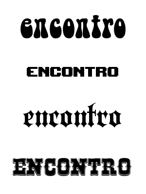

## O que é classificação tipográfica?

Classificação Tipográfica é um modo de organizar famílias tipográficas em conjuntos, e a classificação pode se basear em diversos atributos, como: períodos, estilos, origens, atributos formais, padrões, entre outros.

A primeira tentativa foi realizada pelo historiador de tipografia francês Maximilien Vox e adotada em 1962 pela Association Typographique Internationale (ATypI) e em 1967 pela BS (British Standard). Deste então, dezenas de outras classificações foram criadas, sendo duas das principais causas o aumento exponencial da quantidade de tipografias e a fusão dos diversos estilos.

Quando falo em dezenas, não é um palpite, nossa pesquisa nos levou a encontrar uma documentação que constata [25 Sistemas de Classificação Tipográfica ( 25 Systems for Classifying Typography: A Study in Naming Frequency )](http://piim.newschool.edu/journal/issues/2013/01/pdfs/ParsonsJournalForInformationMapping_Childers_Griscti_Leben.pdf).

## A importância da classificação tipográfica

Cada época apresenta um padrão estético (tendências e estilos) que se manifestava pela pintura ou fotografia, música, arquitetura, […] e tipografia, é claro. Cada projeto de design possui uma linguagem dentro de seu conceito, dentro dessa linguagem nós podemos estabelecer elementos gráficos, paletas de cores, estilo de fotografia, […] e tipografia, que darão o tom para a comunicação. Mais rígida ou flexível, tradicional ou inovadora, clássica ou contemporânea e assim por diante. Veja a imagem a seguir:

Simplesmente escrevi a palavra “encontro” e alternei tipografias. Isso muda o tom da mensagem, o cérebro do receptor vasculhará entre as referências algo que se assemelhe ao visto.

A primeira parece algo hippie, logo, anos 60, mas não é possível imaginar que encontro seja. O segundo “encontro” é bem quadradão, pixelado, games? Um encontro de Nintendistas saudosista? Pode ser! O terceiro encontro com essa letra gótica pode ser musical, um encontro de bandas de heavy metal! E o último, encontro de country!

Essas referências que fazem parte da cultura de um local (cidade, estado, país, continente) podem chamar atenção e aguçar a curiosidade do leitor. No entanto, se ele não identificar referências é porque ele não faz parte do público-alvo ou o designer trabalhou mal a tipografia.

E outro ponto importante é que se você não quisesse utilizar exatamente essas tipografias, mas ainda assim expressar a mesma ideia, ao saber a classificação você possui um ponto de referência para a pesquisa, tornando-a mais rápida e fácil. Os sites de downloads de fontes que o digam!

Por fim, uma conversa entre profissionais torna-se mais coesa, nada de: “tracinho”; “tipo a Helvetica”; “tipo aquela que era usada nos monumentos de Roma”; “aquela da Bíblia de Gutenberg”.

E sim: Tipografias serifadas; não serifadas, grotescas ou Neo Grotescas (dependendo da classificação); tipografias Romanas, tendo como maior representante a Trajan (encontrada na base da Coluna de Trajano); Blackletter Textura ou Gotish.

> [Para saber mais sobre Classificações Tipográfias, continue lendo neste artigo.](/classificacoes-tipograficas-em-detalhes)

*Esse texto pertence a série "Revividos". São posts que foram realizados no antigo blog cmyk ativo e, por algum motivo possuem importância para estarem presentes aqui.*