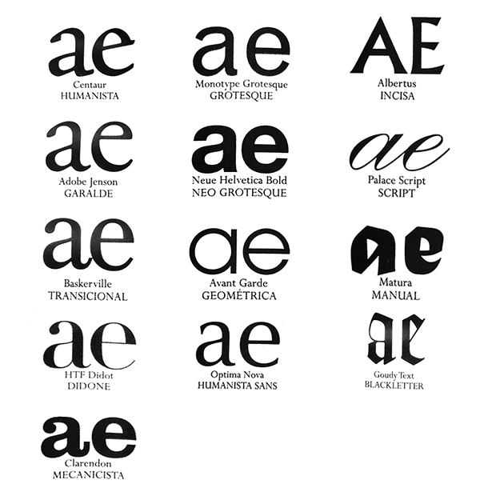
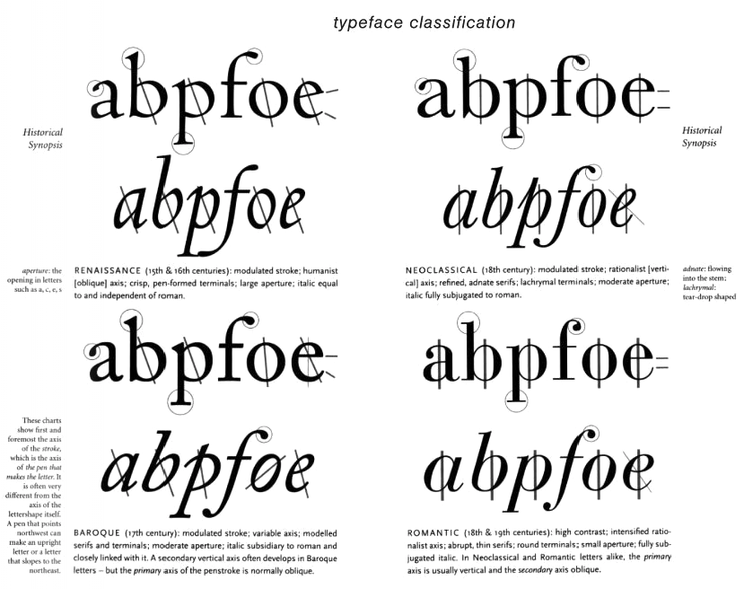
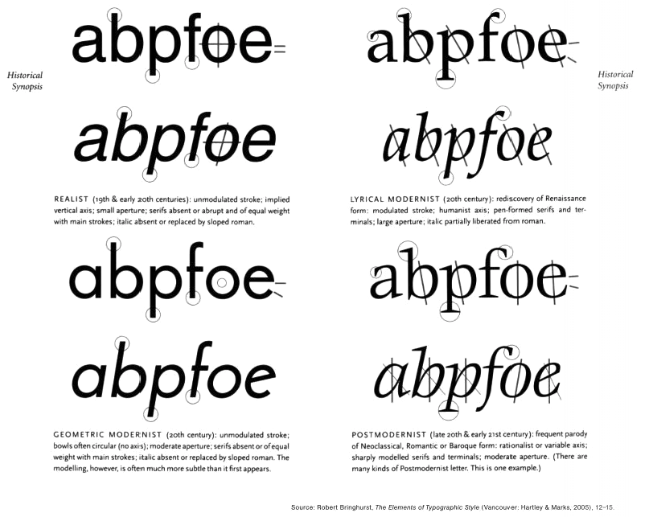
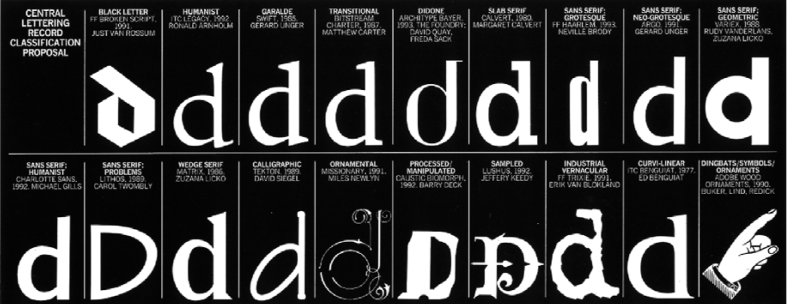

## Classificação Tipográfica de Vox

> Nessa classificação, ele agrupou os tipos em 11 categorias, incluindo os nomes compostos Garalde (Garamond+Aldus) e Didone (Didot+Bodoni). Apenas poucas fontes foram citadas como exemplos nessa classificação, notadamente tipos originais e suas releituras mais fiéis, privilegiando o registro histórico. Apesar da sua importância para o estudo da comunicação, a classificação de Vox (apresentada a seguir) é pouco eficiente para explicar o cenário contemporâneo. Naquela época, antes da explosão digital, o volume de fontes disponíveis girava em torno de 10% do volume encontrado no mercado atualmente. A facilidade e rapidez em produzir fontes no ambiente digital, somadas à complexificação da comunicação visual levaram a uma multiplicidade de combinações de estilos e experimentações inusitadas, aumentando exponencialmente o número de fontes. - ROCHA, Claudio. Novo Projeto Tipográfico. São Paulo: Rosari, 2012.

- **Humanista** - Reúne fontes baseadas nos primeiros tipos latinos produzidos em Veneza no século XIV, baseados na escrita humanista: Kennerley, Jenson, Centaur. Características: 'e' caixa-baixa com a barra inclinada; eixo inclinado para a esquerda; pouco contraste entre traços finos e grossos; serifas adnatas (cantos arredondados). Esse grupo também é conhecido como Veneziano.

- **Garalde** - Fontes baseadas nos tipos criados por Francesco Griffo para Aldus Manutius: Garamond, Sabon, Bembo, Caslon, Dante. Apresenta as mesmas características das fontes Humanistas, exceto o 'e' caixa-baixa, que possui a barra horizontal e contraste mais acentuado entre traços finos e grossos. A classificação BS não faz distinção entre esses dois primeiros grupos, reunindo-os com o nome Old Face. Nos EUA são conhecidos como tipos Old Style.

- **Transicional** - Fontes situadas entre as Old Faces e as Modernas: Baskerville, Fournier, Bell, Caledónia. A principal característica é a ausência de inclinação do eixo das curvas. Nesse grupo os caracteres perdem a emulação da fluência da pena caligráfica e passam a ser mais "desenhados". A referência original é a Roman du Roi, do typecutter francês Philippe Grandjean (1666-1714), com caracteres construídos em bases matemáticas de um quadrado subdividido em 2.304 partes.

- **Didone** - Também conhecidas como Modernas, as fontes pertencentes a esse grupo referem-se aos tipos criados por Firmin Didot e Giambattista Bodoni no século XVIII, e às suas versões posteriores e releituras, como a Walbaum. Características: grande contraste entre traços finos e grossos.

- **Mecanicista** - Também conhecidas como Slab Serifs ou, na Inglaterra, como Egípcias. Fontes serifadas, baseadas nos tipos produzidos durante a Revolução Industrial: Clarendon, Rockwell, Stymie, Memphis. Características: pouco ou nenhum contraste entre traços grossos e finos; serifas retangulares.

- **Linear** - Também conhecidas como Sans Serifs ou ainda Grotesque. Nos EUA são conhecidas como Gothic.Vox criou quatro subdivisões nesta categoria:

- **Grotesque** - fontes sem serifa que têm origem no século XIX, como Monotype Grotesque, Franklin Gothic e Akzidenz Grotesk.

- **Neo Grotesque** - derivadas das Grotesque e produzidas durante o século XX, como Helvética e Univers.

- **Geométrica** - fontes construídas com formas geométricas, baseadas em círculos e retângulos, como Futura, Avenir, Erbar, Eurostile e Avant Garde.

- **Humanista** - tipos sem serifa baseados nas proporções das maiúsculas romanas e das caixas-baixas oldface: Óptima, Gill Sans, Stellar.

- **Incisa ou Gliphic** - Nesta categoria se inserem fontes com o aspecto das letras inscritas em pedra, muitas vezes em caixa-alta: Augustea, Albertus e Hadriano.

- **Script** - Fontes que emulam letras manuscritas, em oposição ao próximo grupo das manuais. Exemplos: Palace Script, Shelley, Mistral.

- **Manual ou Graphic** - Inclui fontes baseadas em letras produzidas com pincel, pena ou outro instrumento, mas sem o caráter manuscrito: Matura, Banco.

- **Blackletter** - O tipo gótico é baseado na escrita originada ao norte dos Alpes, na Europa. Seus traços são grossos, obtidos com pena de ponta chanfrada, que resultam letras contrastadas, com curvas quebradas e terminações angulares, em um estilo também conhecido como broken script (em inglês, escrita quebrada). Os tipos góticos estão divididos em quatro grupos principais:
  - **Textura ou Gotish** ou ainda littera textualis foi o estilo utilizado Gutenberg na Bíblia de 42 linhas, com letras estreitas típicas.
  - **Bastarda ou Schwabacher**, um estilo vernacular bastante popular que gerou os primeiros tipos alemães. E baseado na escrita cursiva.
  - **Rotunda ou Rundgotisch**, com letras arredondadas e sem terminações, com os retângulos característicos das blackletters.
  - **Fraktur** é o tipo gótico mais comum na Alemanha atualmente e mostra influências do estilo renascentista.

## Classificação Tipográfica de Robert Bringhurst

Dois novos sistemas se contrapõem a essa classificação clássica. Mais do que agrupar fontes, buscam descrevê-las e qualificá-las por seus atributos técnicos e estéticos em contextos específicos. O primeiro, de Robert Bringhurst, aparece no livro Elementos do Estilo Tipográfico, de 1992. 

> É uma classificação baseada em períodos e estilos: renascentista, barroco, neoclássico, expressionista e assim por diante, relacionando a tipografia a outras manifestações artísticas como a música, a arquitetura e a pintura. ROCHA, Claudio. Novo Projeto Tipográfico. São Paulo: Rosari, 2012.

## Classificação Tipográfica de Catherine Dixon

Em 2001, [Catherine Dixon propôs um sistema](https://infodesign.emnuvens.com.br/public/journals/1/No.2Vol.5-2008/ID_v5_n2_2008_21_35_Dixon.pdf?download=1&phpMyAdmin=H8DwcFLEmv4B1mx8YJNY1MFYs4e) que explica os desdobramentos do type design a partir de três componentes principais: Origens (decorativa/pictórica, manuscrita, romana, vernacular do século XIX e aditiva); Atributos Formais (construção, formato, modulação, terminações, proporções, peso, caracteres-chave e acabamento); e Padrões (estabelecidos quando os dois componentes anteriores se tornam fixos). ROCHA, Claudio. Novo Projeto Tipográfico. São Paulo: Rosari, 2012.

*Esse texto pertence a série "Revividos". São posts que foram realizados no antigo blog cmyk ativo e, por algum motivo possuem importância para estarem presentes aqui.*
