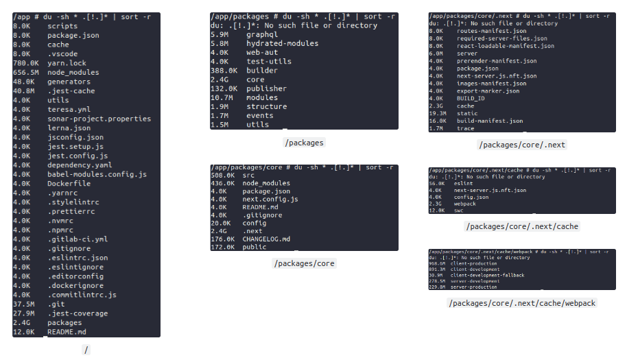

## Introdução

Nós tratamos em um post anterior uma situação onde conseguimos reduzir o tamanho de uma imagem Docker.  
Exploramos as diferentes tags de imagens Node que contém mais ou menos recursos.  
Desta vez partimos de outro ponto, onde estamos utilizando a imagem mais enxuta possível.

Sobre o projeto:

- Instana;
- Lerna: v3.22.1
- NextJS: v12.2;
- Node: v14.17.3;
- OpenTelemetry;

Analisando o Dockerfile do projeto é possível perceber que é construído com base na imagem `node:14.17.3-alpine`. A tag **alpine** indica que é uma versão com o mínimo de recursos e, por isso, podemos concluir que nosso trabalho não será voltado a testar diferentes versões de imagens base.

> Nosso ponto de partida será um build padrão realizado localmente com Docker `version 20.10.8`, `build 3967b7d` utilizando o comando: `docker build -t xablau .` que resultou numa imagem de `3.43GB`.

Ao subir o container (rodar a imagem criada acima) com o comando `docker run --name xablau -p 3000:5000 -dit xablau` a aplicação funcionou normalmente acessando o endereço local.

Ao entrar no container em modo iterativo `docker exec -it xablau sh` foi possível listar os diretórios e arquivos conforme as imagens abaixo utilizando o comando `du -sh * .[!.]* | sort -r`. 




## O que podemos constatar vendo isso?

- `dot files` estão sendo copiados para a imagem desnecessariamente;
- Arquivos de configuração estão sendo copiados para a imagem desnecessariamente;
- A aplicação está sendo buildada na pasta `packages/core/.next` com `2.4GB`;
- [Esta é a pasta padrão de build do NextJS](https://upmostly.com/nextjs/where-does-nextjs-put-build-folder), _All JavaScript code inside .next has been compiled and browser bundles have been minified to help achieve the best performance and support all modern browsers_ – [Documentação Oficial](https://nextjs.org/docs/deployment#nextjs-build-api).
  - Dentro da pasta `/packages/core/.next/cache/webpack` existem aparentemente diversas versões de build, incluindo `development` que podemos explorar a possibilidade de exclusão;
- Não é possível assumir quais arquivos são vitais para a aplicação dentro da pasta `packages` e seus subdiretórios ou lendo a documentação do NextJS;


## Docker Multi Stage Building

Ao invés de investirmos em ignorar arquivo por arquivo utilizando o `.dockerignore` vamos dividir o build em etapas e levar até a imagem final somente o mínimo para rodar a aplicação.

**Abaixo é possível conferir o Dockerfile com explicações.**

```
## Step 01: continua muito semelhante ao original
FROM node:14.17.3-alpine AS builder
RUN apk add --no-cache git
WORKDIR /app
ADD . /app
RUN npx next telemetry disable && yarn build

## Step 02: removendo as pastas com build que contenham a palavra `development`
FROM builder AS slim-prod
RUN cd /app/packages/core/.next/cache/webpack && ls | grep -E ".*-development*" | xargs rm -rf

## Step 03: Imagem final
FROM node:14.17.3-alpine AS production

## Essa porta é importante pois está no comando `start` no package.json
ENV PORT="5000"
WORKDIR /app

## package.json que contém o comando de start da aplicação
COPY ./package.json ./package.json

## node_modules copiada pois o @instana necessita de suas N dependências
COPY --from=slim-prod /app/node_modules /app/node_modules

## Diretório `packages` somente com builds de `production`
COPY --from=slim-prod /app/packages /app/packages
EXPOSE 5000
CMD ["yarn", "start"]
```

## Conclusão

Essa imagem gerada possui o tamanho de 1.87GB, aproximadamente 45% de redução em comparação com o tamanho inicial.
