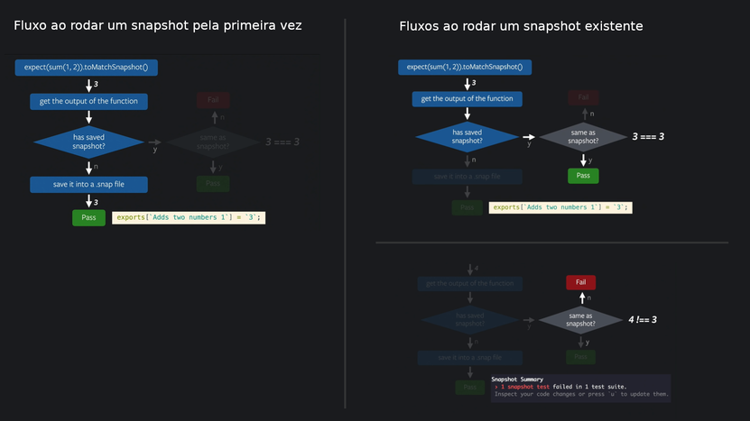
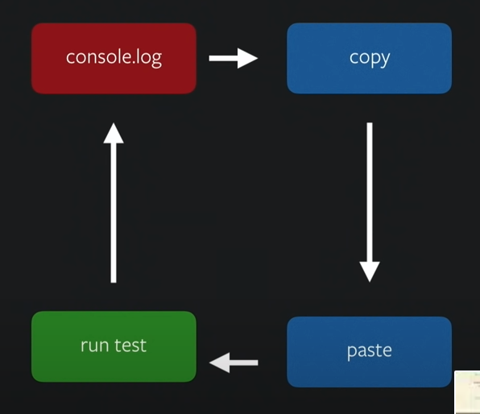

## Contexto

Por conta de uma discussão no trabalho sobre **Jest snapshot tests** aplicados em componentes de interface acabei realizando uma pesquisa usando como base um dos próprios projetos que sou mantenedor na equipe e neste post você lerá o resultado.

## Objetivos

Esta pesquisa busca trazer pontos positivos e negativos da utilização de **Jest snapshot tests** em UI para fomentar uma discussão e direcionar a equipe para o que seria a melhor prática no contexto atual.

## Análise

### Introdução

Para iniciar a análise, nada melhor do que olhar para dentro da organização e buscar informações sobre o assunto e visto o conteúdo encontrado podemos afirmar que:

- Existe uma cultura que encoraja a escrita de testes unitários;
- Não existe acordo com relação a uso de tecnologias específicas;
- Não existe discussão - pelo menos documentada - sobre a utilização de snapshots no frontend;

### Explorando o assunto

#### O que são Jest Snapshots

Começando do começo… Snapshots são artefatos, arquivos de texto com extensão `.snap` que normalmente testam casos de uso em componentes de interface.

Se houver dentro de um teste o comando `toMatchSnapshot()` em sua primeira execução será gerado um snapshot (texto serializado bem semelhante a uma estrutura HTML) e guardado junto ao teste, a partir deste momento, nas próximas vezes essa referência é comparada e caso haja uma diferença o teste falha e você recebe um alerta.

`Exemplo de snapshot`

```js
// Jest Snapshot v1, https://goo.gl/fbAQLP

exports[`[Components] Pill render the component 1`] = `
Object {
  "asFragment": [Function],
  "baseElement": <body>
    <div>
      <div
        class="style__Pill-sc-1xvisr1-0 fmqRXk"
        title="Hello world"
      >
        Hello world
      </div>
    </div>
  </body>,
  "container": <div>
    <div
      class="style__Pill-sc-1xvisr1-0 fmqRXk"
      title="Hello world"
    >
      Hello world
    </div>
  </div>,
  "debug": [Function],
  "findAllByAltText": [Function],
  "findAllByDisplayValue": [Function],
  "findAllByLabelText": [Function],
  "findAllByPlaceholderText": [Function],
  "findAllByRole": [Function],
  "findAllByTestId": [Function],
  "findAllByText": [Function],
  "findAllByTitle": [Function],
  "findByAltText": [Function],
  "findByDisplayValue": [Function],
  "findByLabelText": [Function],
  "findByPlaceholderText": [Function],
  "findByRole": [Function],
  "findByTestId": [Function],
  "findByText": [Function],
  "findByTitle": [Function],
  "getAllByAltText": [Function],
  "getAllByDisplayValue": [Function],
  "getAllByLabelText": [Function],
  "getAllByPlaceholderText": [Function],
  "getAllByRole": [Function],
  "getAllByTestId": [Function],
  "getAllByText": [Function],
  "getAllByTitle": [Function],
  "getByAltText": [Function],
  "getByDisplayValue": [Function],
  "getByLabelText": [Function],
  "getByPlaceholderText": [Function],
  "getByRole": [Function],
  "getByTestId": [Function],
  "getByText": [Function],
  "getByTitle": [Function],
  "queryAllByAltText": [Function],
  "queryAllByDisplayValue": [Function],
  "queryAllByLabelText": [Function],
  "queryAllByPlaceholderText": [Function],
  "queryAllByRole": [Function],
  "queryAllByTestId": [Function],
  "queryAllByText": [Function],
  "queryAllByTitle": [Function],
  "queryByAltText": [Function],
  "queryByDisplayValue": [Function],
  "queryByLabelText": [Function],
  "queryByPlaceholderText": [Function],
  "queryByRole": [Function],
  "queryByTestId": [Function],
  "queryByText": [Function],
  "queryByTitle": [Function],
  "rerender": [Function],
  "unmount": [Function],
}
`;
```

É bom ressaltar que [segundo a própria documentação](https://jestjs.io/docs/snapshot-testing#does-snapshot-testing-replace-unit-testing) **snapshots não substituem testes unitários**, na verdade buscam prover um valor adicional. Dito isso, em alguns cenários específicos podem remover a necessidade de testes unitários.

Abaixo nós temos um exemplo usando uma função de soma para exemplificar como um snapshot funciona:



#### Snapshots influenciam na porcentagem de coverage do projeto?

Resposta curta: **Sim**. [A própria documentação confirma este fato](https://jestjs.io/docs/snapshot-testing#does-code-coverage-work-with-snapshot-testing).

No entanto, fomos além e um teste foi feito no projeto utilizando o comando `npm run test:coverage` para comprovar esta afirmação. Um report **inicial** foi retirado e comparado com um **secundário** onde as 47 ocorrências do comando `toMatchSnapshot()` em 45 arquivos foram comentadas. Vejamos as diferenças:

|                        | Statements | Branches | Functions | Lines  |
| ---------------------- | ---------- | -------- | --------- | ------ |
| Inicial                | 98.83%     | 96.02%   | 99.07%    | 98.89% |
| Modificado             | 98.38%     | 95.74%   | 98.14%    | 98.52% |
| Diferenças percentuais | 0.45%      | 0.28%    | 0.93%     | 0.37%  |

Podemos concluir que mesmo de maneira sutil há influência de snapshots na cobertura total do projeto.

#### Primeiras impressões

Vamos iniciar nosso debate [a partir de um texto escrito por Kent C. Dodds](https://kentcdodds.com/blog/effective-snapshot-testing) que procura contra-argumentar alguns pontos levantados por Justin Searls sobre snapshots e opiniões de devs em fóruns diversos.

Segundo referências pesquisadas, alguns desenvolvedores consideram que snapshots não testam nada além da diferença entre o estado anterior e a nova modificação. Um simples diff.

Além disso, economizam tempo no primeiro momento da sua criação mas depois demandam manutenção assim como testes unitários.

Provêm uma falsa sensação de segurança pois não garantem o comportamento correto do componente.

Quebram com mínimas modificações:

> Testes que falham em qualquer modificação são tão ruins quanto testes que nunca falham. - Tradução literal de [Canenald](https://www.reddit.com/r/reactjs/comments/cgcuv5/snapshot_tests_pros_and_cons/eujwk5r/?utm_source=reddit&utm_medium=web2x&context=3).

E por fim, o próprio Facebook fala para usarmos asserções ao invés de snapshots:

> It’s typically better to make more specific assertions than to use snapshots. These kinds of tests include implementation details so they break easily, and teams can get desensitized to snapshot breakages. - [React Oficial Documentation: Snapshot Testing](https://reactjs.org/docs/testing-recipes.html#snapshot-testing)

#### Contexto de aplicação de snapshots

Segundo Justin, snapshots são testes que você geralmente não entende quando falham e por serem gerados automaticamente (e com facilidade) desenvolvedores tendem a sobrescrevê-los ao invés de descobrir a raíz do problema. Se esse comportamento não é assumido nas primeiras vezes, é adquirido com o passar do tempo.

> _\[…\] when the code changes, the tests will surely fail, but determining whether and what is actually "broken" by that failure is the more painful path than simply re-recording & committing a fresh snapshot. - Justin Searls._

Vendo de outra perspectiva, Rogelio Guzman autor da palestra [Jest Snapshots and Beyond - React Conf 2017](https://www.youtube.com/watch?v=HAuXJVI_bUs&list=PLb0IAmt7-GS3fZ46IGFirdqKTIxlws7e0) que traz um ponto de vista onde snapshots servem para automatizar/delegar/tirar o fardo do trabalho manual de atualizar testes das mãos de desenvolvedores.

E por serem processos automatizados são fáceis de lidar, não importa se você necessita atualizar 1 snapshot ou 100. No entanto, isso necessariamente quer dizer que se adaptam a mudanças e são fáceis de manter? 🤔

##### Testando retornos de API

Em sua explicação Rogelio utiliza um [exemplo de teste de retorno de API](https://youtu.be/HAuXJVI_bUs?t=334) (veja o vídeo para melhor entendimento) onde a cada nova informação que é retornada na API se faz necessário atualizar o mock - quem nunca passou por isso? - e que muitas vezes nós utilizamos um `console.log` para verificar as novas informações, copiamos e colamos a atualização, criando um ciclo, como na imagem a seguir.



> Who's making the assertion, is it you or your test? - [Juliano Rafael](https://dev.to/frontendwizard/don-t-snapshot-your-ui-components-make-assertions-41b5).

Em casos como esse, seria mais fácil somente rodar um comando e atualizar um snapshot.

##### Testando componentes

E sobre testar a renderização de componentes que são mais complexos, o que Rogelio diz? Ele dá três opções:

1. [Simplesmente não teste](https://youtu.be/HAuXJVI_bUs?t=983 "https://youtu.be/HAuXJVI_bUs?t=983");
2. Utilize Selenium/Cypress/Semelhantes;
3. Snapshots serializers usando `Jest 19+`;
   1. No exemplo o método render depende de `enzyme` e foi necessário adicionar a lib: `enzyme-to-json/serializer`, utilizando `shallow` como método de renderização para produzir arquivos legíveis. [Este artigo de Luis Vieira](https://medium.com/@luisvieira_gmr/snapshot-testing-react-components-with-jest-best-practices-dd1585b2b93d "https://medium.com/@luisvieira_gmr/snapshot-testing-react-components-with-jest-best-practices-dd1585b2b93d") explica em mais detalhes a diferença de outputs no tópico `Watch the snapshot output`.
   2. Basicamente o serializer permite um `prettify`/`formatação` do arquivo de snapshot e a ideia é que você o utilize para gerar snapshots assertivos e de fácil leitura. Aqui temos um artigo mais completo: [Jest Snapshot Serializers](https://medium.com/@luisvieira_gmr/jest-snapshot-serializers-6a96f5c362a1 "https://medium.com/@luisvieira_gmr/jest-snapshot-serializers-6a96f5c362a1").

Enquanto isso, Juliano Rafael em seu artigo [Don't snapshot your UI components, make assertions!](https://dev.to/frontendwizard/don-t-snapshot-your-ui-components-make-assertions-41b5 "https://dev.to/frontendwizard/don-t-snapshot-your-ui-components-make-assertions-41b5") apoia a criação de testes utilizando asserções, por exemplo:

`Exemplo de teste com asserções (expect)`

```js
describe("Card", () => {
  it("should show image and title", () => {
    const title = "Title of my post";
    const url = "some url for the image";
    const altText = "description of the image";
    const { getByText, getByAltText } = render(() => (
      <Card image={url} title={title} />
    ));
    getByText(title);
    expect(getByAltText(altText)).toHaveAttribute("src", url);
  });
});
```

E defende os seguintes pontos:

- Mensagens de erro assertivas: Snapshots mostram o que está errado com o componente baseado em comparação com um bom diff mas pára por aí. Com asserções as mensagens realmente falam o que está errado, por exemplo: `TestingLibraryElementError: Unable to find an element with the alt text: description of the image`
- Sem falsos positivos: Se você adicionar uma nova informação neste card (sem alterar as existentes) os testes não quebrarão.
- Você está consumindo o componente como o usuário: A utilização das queries providas pelo `dom-testing-library` forçam a usar os componentes como um usuário usaria (procurando por textos, botões ou imagens).

#### Snapshots gigantes

Ambos também concordam que snapshots grandes são armadilhas e não estamos falando de 4000 linhas, aproximadamente 600 já são suficientes para que todos desistam de colocar esforço na revisão caso haja alguma mudança. É inclusive indicado o uso da flag `no-large-snapshots` do [eslint-plugin-jest](https://github.com/jest-community/eslint-plugin-jest/blob/main/docs/rules/no-large-snapshots.md) para desencorajar essa prática.

#### Intenção por trás do teste

Justin ainda vai além e comenta que bons testes devem expressar a intenção do autor e snapshots não fazem isso. No caso, nem **o que** o código faz muito menos o **porquê** ele faz.

Não foram encontrados dados para refutar o argumento acima, inclusive, o fato de não ser possível realizar TDD (Test Driven Development) com snapshots é uma comprovação.

Visto isso, se um snapshot testa um cenário estático, ou seja, como um componente deve se parecer e, não testa mudanças de estados, seria válido para manter a consistência para componentes de Design System? 🤔

#### Utilizando snapshots de maneira correta

Segundo autores de nossa pesquisa o maior problema envolvendo snapshots é sua verbosidade e imprecisão, sendo assim, tentaremos trazer abordagens sugeridas para mitigar esse problema e tentar mensurar em poucas palavras se “vale o esforço”.

##### Snapshot Serializers

Veja o código abaixo que foi inserido logo após os imports de um teste:

```js
expect.addSnapshotSerializer({
  test: (object) => typeof object === "string",
  print: (object) => {
    console.dir({ object });
    return object;
  },
});
```

Neste exemplo nós estamos fazendo algumas coisas:

- O simples fato de fazer essa declaração num arquivo de teste já está afetando como todos os métodos `toMatchSnapshot()` dentro deste teste renderizam o resultado;
- O método `test` existe para garantir que estamos recebendo uma string e esse é o único tipo suportado. Ele é executado e em seguida passa o valor para o método `print`;
- O método `print` itera sobre o snapshot dando `console.log`, esse seria o momento onde colocaríamos nosso código para fazer modificações. Esta declaração por si só altera o snapshot, removendo as aspas dos atributos e vamos conversar sobre o porquê.

Imagine o seguinte trecho gerado por um snapshot:

```js
          <span
            class="MuiIconButton-label"
          >
            <svg
              class="style__BagIcon-sc-1waxn8h-1 jiLboM"
              fill="none"
              height="19"
              width="19"
              xmlns="http://www.w3.org/2000/svg"
            >
              <path
                clip-rule="evenodd"
                d="M13.813.974H5.155c-.853 0-1.516.968-1.516 2.112H15.36c0-1.144-.695-2.112-1.548-2.112ZM17.292 5.974c-.063-1.038-.949-1.832-2.024-1.832H3.76c-1.075 0-1.96.794-2.024 1.832L.977 16.816c-.063 1.13.854 2.107 2.024 2.107h12.995c1.17 0 2.118-.977 2.023-2.107l-.727-10.842Zm-7.778 6.078c-2.56 0-4.648-2.016-4.648-4.46 0-.274.222-.488.506-.488.285 0 .506.214.506.489 0 1.924 1.613 3.45 3.604 3.45 1.992 0 3.605-1.557 3.605-3.45 0-.275.221-.489.506-.489.284 0 .506.214.506.489.063 2.473-2.024 4.459-4.585 4.459Z"
                fill="#fff"
                fill-rule="evenodd"
              />
            </svg>
          </span>
          <span
            class="MuiTouchRipple-root"
          />
        </button>
      </div>
    </header>
```

O método `print` a cada iteração trará somente os valores que forem strings, ou seja, os valores dos atributos, o resto é desconsiderado. Em outras palavras, o conteúdo que você teria acesso seria:

- `{ object: 'MuiIconButton-label' }`
- `{ object: 'style__BagIcon-sc-1waxn8h-1 jiLboM' }`
- `{ object: 'none' }`
- `{ object: '19' }`
- `{ object: '19' }`
- `{ object: 'http://www.w3.org/2000/svg' }`
- `{ object: 'evenodd' }`
- `{` `object: 'M13.813.974H5.155c-.853 0-1.516.968-1.516 2.112H15.36c0-1.144-.695-2.112-1.548-2.112ZM17.292 5.974c-.063-1.038-.949-1.832-2.024-1.832H3.76c-1.075 0-1.96.794-2.024 1.832L.977 16.816c-.063 1.13.854 2.107 2.024 2.107h12.995c1.17 0 2.118-.977 2.023-2.107l-.727-10.842Zm-7.778 6.078c-2.56 0-4.648-2.016-4.648-4.46 0-.274.222-.488.506-.488.285 0 .506.214.506.489 0 1.924 1.613 3.45 3.604 3.45 1.992 0 3.605-1.557 3.605-3.45 0-.275.221-.489.506-.489.284 0 .506.214.506.489.063 2.473-2.024 4.459-4.585 4.459Z'`  
  `}`
- `{ object: '#fff' }`
- `{ object: 'evenodd' }`
- `{ object: 'MuiTouchRipple-root' }`

Enfim, não é útil para nosso objetivo.

##### [snapshot-diff](https://www.npmjs.com/package/snapshot-diff)

Essa lib faz um diff entre os valores gerados por dois testes. Sua utilização é interessante em casos onde gostaria de ser testada a diferença num componente com a mudança de estado do mesmo.

`Código de exemplo`

```js
const React = require("react");
const { toMatchDiffSnapshot } = require("snapshot-diff");
const Component = require("./Component");

expect.extend({ toMatchDiffSnapshot });

test("snapshot difference between 2 React components state", () => {
  expect(<Component test="say" />).toMatchDiffSnapshot(
    <Component test="my name" />,
  );
});
```

Levando em consideração que preocupações com relação a adicionar uma nova lib envolvem:

- Adicionar mais uma dependência no projeto (por mais que não vá para o bundle final);
- Aumento da carga cognitiva necessária para edição do projeto (nova lib > novas docs > novas abordagens);
- Manutenção por parte dos autores;
- Uso da comunidade (se a comunidade não utiliza, provavelmente não será atualizado);

Não acredito que hajam grandes benefícios.

## Conclusão

### Quando utilizar

1. Configurações de projeto como Webpack ou babel plugins;
2. Retornos de API;
3. Assegurar a consistência estética para componentes de Design System;
   - Um bom exemplo são as bibliotecas de componentes que utiliza por ser uma biblioteca de componentes;

### Quando não utilizar

1. Componentes complexos (diversas condições e filhos);

### Possíveis abordagens para o projeto julius-frontend

1. Remover snapshots e testar com asserções os trechos que ficaram sem cobertura;
2. Continuar utilizando snapshots e fazer testes de asserção para complementar cenários que necessitem;

## Referências

- [Snapshot Testing - Jest](https://jestjs.io/docs/snapshot-testing)
- [Snapshot tests - pros and cons](https://www.reddit.com/r/reactjs/comments/cgcuv5/snapshot_tests_pros_and_cons/)
- [Jest Snapshot testing vs unit testing? - StackOverflow](https://stackoverflow.com/questions/43771602/jest-snapshot-testing-vs-unit-testing)
- [Don't snapshot your UI components, make assertions! por Juliano Rafael](https://dev.to/frontendwizard/don-t-snapshot-your-ui-components-make-assertions-41b5)
- [When to use Jest snapshot tests: comprehensive use-cases and examples](https://codewithhugo.com/abusing-jest-snapshot-tests-some-nice-use-cases/)
- [Effective Snapshot Testing - Kent C. Dodds](https://kentcdodds.com/blog/effective-snapshot-testing)
- [Why I write Snapshot tests? - Aaina jain](https://medium.com/@aainajain/ios-snapshot-testing-286b44e64350)
- [Using snapshot testing with Jest - Pros and Cons - Github](https://github.com/nielsen-oss/docs/issues/9)
- [How We Stopped Checking Side Effects and Learned to Love Snapshot Testing](https://www.xmatters.com/blog/how-we-stopped-checking-side-effects-and-learned-to-love-snapshot-testing/)
- [Pros and cons of Jest snapshot testing with some useful tips](https://tsh.io/blog/pros-and-cons-of-jest-snapshot-tests/)
- [Snapshot Testing: Benefits and Drawbacks](https://www.sitepen.com/blog/snapshot-testing-benefits-and-drawbacks)
- [Rogelio Guzman - Jest Snapshots and Beyond - React Conf 2017](https://www.youtube.com/watch?v=HAuXJVI_bUs)
- [Snapshot testing React components with Jest — Best Practices](https://medium.com/@luisvieira_gmr/snapshot-testing-react-components-with-jest-best-practices-dd1585b2b93d)
- [Creating a Custom Jest Snapshot Serializer](https://justinnoel.dev/2019/08/31/creating-a-jest-snapshot-serializer/)
