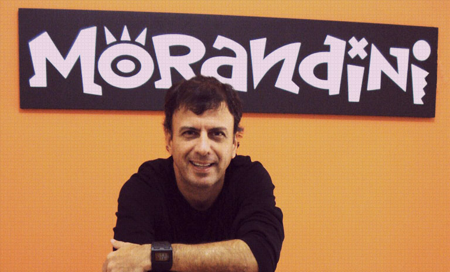
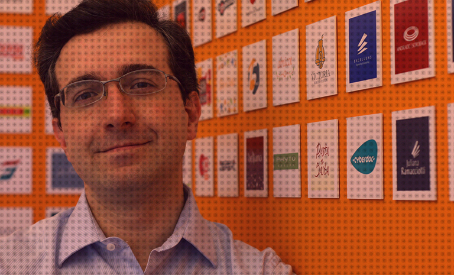

Reunir seus melhores trabalhos em uma apresentação legal que faça o entrevistador te contratar para aquela vaga dos sonhos – parece fácil de resolver, mas sabemos que não é.

Pensando nisso, resolvemos entrevistar três grandes profissionais da área: Saulo Mileti, Morandini ([Morandini](https://morandini.com.br/)) e Sebastiany ([Sebastiany Branding](https://www.sebastiany.com.br/)) e, eles reponderam perguntas que todos gostaríamos de saber.

> ## Saulo Mileti

### _O que é mais interessante ver em portfolio? (Mais trabalhos comerciais, pessoais, peças “fantasmas”)_

Na verdade tudo é válido. Seja comercial, pessoal ou fantasma, o que interessa não é se foi para a rua, mas se a ideia é boa. No entanto a maior parte das pastas busca mostrar apenas técnica. E se o portfolio for para uma vaga de ilustrador, manipulador ou arte finalista, isso faz todo o sentido. Mas para direção de arte ou designer? Não.

Isso não significa que esse profissional pode ser relapso tecnicamente, mas sim que a ideia é a coisa mais importante no trabalho dele. E se ela for ruim, nem o layout mais belo do planeta salvará a peça. Se você não tem bagagem, crie peças fantasmas desafiadoras – não anúncios patéticos de iPhone. Se você só tem trabalhos pessoais, tente deixar de lado o amor que sente por eles e questione se são relevantes esteticamente e comercialmente para sobreviverem ao olhar no contratante.

E se você tem trabalhos comerciais, mas prefere a sua versão (antes das alterações e podadas do cliente), toca pau. Como disse anteriormente: não interessa se foi pra rua; o que queremos ver é se a ideia é boa ou não.

### _Para quem está começando, como um designers recém formado, o que é recomendado colocar no portfolio?_

Portfolios longos são cansativos. Lembre-se: quanto mais tempo você tomar na hora da apresentação, maior a chance do entrevistador ser interrompido pelos problemas acontecendo na agência. Isso tirará o foco dele e diminuirá suas chances. Então, siga essas três regras:

a) Não minta. Esse é um mercado pequeno, onde todos se conhecem. Se você tem pouca experiência, fale – e deixe claro que quer aquela oportunidade para começar a sua carreira e surpreender.

b) Seja sintético. Não vá com discurso ensaiado. Não recite poemas e contos maravilhosos sobre a sua história de vida. Um bom criativo precisa ser objetivo. Seja um “Twitter” ambulante: bons insights cabem em 140 caracteres.

c) Dê ritmo ao seu portfolio. É como um filme: se você colocar as melhores cenas no começo, o resto do filme fica cansativo. Portanto, se você tiver um portfolio de 10 peças, crie uma dinâmica. Não deixe a pasta esfriar muito cedo ou demorar demais pra esquentar. É como jogar peteca.

### _O que é ruim de ser ter no portfolio? Existem trabalhos “queima-filme”?_

Existem trabalhos ruins, posturas ruins e clichês ruins.

Os trabalhos ruins são os não factíveis: coisas que jamais aconteceriam no mundo real. Anúncio duplo com 1 nano-frase em Helvetica Bold 8px e o logo da empresa com 3 milímetros de largura. Pode até ser bonito esteticamente, mas só funciona no mundo dos portfolios. E se é utópico (sem a menor chance de acontecer no mercado), é irrelevante.

As posturas ruins são as que ultrapassam os limites profissionais. Vejo muito portfolio com frases como “Deus é fiel”, “Tudo posso Naquele que me fortalece” e coisas do tipo. Respeito sua religião e acho que você deve buscar a felicidade nela se é algo que te faz bem. No entanto isso não interessa no âmbito profissional. Negócios são negócios. O que eu quero saber é se você é inteligente, criativo, capaz e pode agregar talento para empresa. Esqueça qualquer coisa além disso.

Os clichês são a pior parte. Oito em cada dez portfolios que eu recebo tem um logo composto com as duas ou três iniciais do nome do candidato. Por exemplo: o sujeito se chama José da Silva e cria um logo “JS” no cabeçalho do resumé / portfolio. Muita gente acha que clichê é algo ruim: não é. Uma coisa se torna clichê por ser tão boa, que todo mundo faz – até se tornar cansativo. O problema dele, no campo profissional, é que é uma espécie de contra-ideia. É a zona de conforto. É a escapatória para não se esforçar e ter uma sacada inteligente. Portanto, corra disso.

> ## Morandini

### _O que é mais interessante ver em portfolio? (Mais trabalhos comerciais, pessoais, peças “fantasmas”)?_

Isso depende muito do tempo que o profissional tem de mercado e da consistência de sua carreira.
Num cenário ideal, onde já há um bom caminho percorrido, o portfolio deveria mostrar apenas trabalhos comerciais. Nada contra os trabalhos pessoais ou ‘fantasmas’, mas os trabalhos produzidos para o ‘mundo real’ carregam a história de todo o processo pelo qual o profissional passou para chegar lá: briefing, prazos, dificuldades, interferências e respostas para os problemas apresentados. Essas condições e o resultado final dificilmente seriam alcançados num trabalho pessoal, onde as condições são mais brandas e controladas. Um portfolio com peças comerciais permite uma avaliação muito mais acurada e precisa do potencial de um profissional criativo.

### _Para quem está começando, como um designer recém formado, o que é recomendado colocar no portfolio?_

Penso que um portfolio é algo dinâmico e vivo. Ele deve crescer e evoluir de acordo com crescimento, a evolução e os direcionamentos que o profissional obtiver ao longo da vida. Num primeiro momento, quando ainda não há trabalhos relevantes realizados, é recomendável a inserção de peças acadêmicas, desde que tenham algo para contar. Ainda é possível inserir trabalhos filantrópicos ou mesmo pessoais, deixando sempre essas condições muito claras.

Independentemente do teor, os trabalhos e a apresentação devem ser sempre muito claros e primarem pela qualidade de execução e originalidade.
Uma peça acadêmica não deve ser sinônimo de improvisação, uso indevido de imagem de terceiros ou desleixo. Se apresentar algum desses pontos, é porque não deve ir para o portfolio.

Para um iniciante, melhor ter poucas peças que impressionem pela excelência do que tentar impressionar pela quantidade de trabalhos.

### _O que é ruim de ser ter no portfolio? Existem trabalhos “queima-filme”?_

Nenhuma loja coloca na vitrine aquilo que não quer vender. Nosso portfolio é nossa vitrine. Como tal, deve traduzir exatamente aquilo que temos na ‘loja’.

Para obter êxito nessa questão, é necessário abrir mão do emocional e dar vazão ao racional. De nada adianta colocar aquela capa de livro que adoramos fazer se atuar na área editorial não faz parte dos nossos planos. É preciso que pensemos na nossa vitrine como uma ferramenta de comunicação, divulgação e promoção. Ele precisa estar em perfeita sintonia com os trabalhos e clientes que almejamos conquistar.

Trabalhos que sofreram muitas interferências externas e acabaram por se distanciar do briefing devem ser evitados pois não representam a produção de determinado profissional em sua essência.

Por fim, um comentário de caráter absolutamente pessoal: depois de 30 anos de carreira, meu trabalho foi assumindo um perfil cada vez mais autoral. Inconscientemente, minha produção passou a ter uma cara muito própria. Para evitar algum tipo de ‘ruído’ na leitura do meu portfolio, gradativamente fui excluindo as peças mais tradicionais e antigas, que já não representavam o caráter dos meus projetos. Isso evitou causar uma certa incoerência na minha ‘loja’, não permitindo que a vitrine mostrasse um produto e as prateleiras estivessem abarrotadas de mercadorias diferentes.

> ## Guilherme Sebastiany

### _O que é mais interessante ver em portfolio? (Mais trabalhos comerciais, pessoais, peças “fantasmas”)?_

Não vejo problema o portfólio mesclar cases reais, trabalhos de faculdade, e cases fantasmas, desde que fique sempre claro quando é cada caso. Independente disto, o que para mim é mais importante é ver o processo de como o trabalho foi feito. Ver os estudos e o processo ajuda a entender não apenas a capacidade do resultado, mas sim como o profissional ou estudante trabalha, pensa e lida com metodologia.

### _Para quem está começando, como um designer recém formado, o que é recomendado colocar no portfolio?_

Coloque o que tiver de melhor. Não inclua trabalhos que você mesmo considera abaixo da média apenas para fazer volume. E lembre-se de sempre atualizar o portfólio, pois o desenvolvimento profissional nos primeiros anos é muito acelerado. No seu portfólio, o seu melhor trabalho hoje pode ser o seu pior em um ano ou dois.

### _O que é ruim de ser ter no portfolio? Existem trabalhos “queima-filme”?_

Sempre existem. Geralmente é um projeto significativamente abaixo da média dos demais. Mas o que queima mais o filme é no caso de trabalhos profissionais, não dar crédito aos demais colegas que fizeram o trabalho junto e nem ao escritório onde foi feito. E no caso de projetos acadêmicos, não colocar nem o nome dos demais integrantes do grupo e nem do professor orientador. Sempre inclua o nome do orientador, afinal, ele é tão responsável pelo resultado final quanto você, e deve ser valorizado!

*Esse texto pertence a série "Revividos". São posts que foram realizados no antigo blog cmyk ativo e, por algum motivo possuem importância para estarem presentes aqui.*