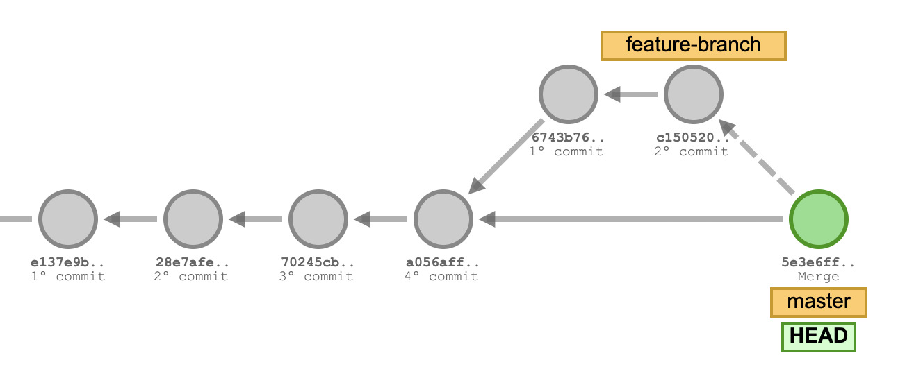

> ### Tópicos do post
> Busca responder algumas perguntas como: 
> - [O que é Git?](#o-que-e-git)
> - [Por que eu deveria usar versionamento?](#por-que-usar-versionamento)
> - [Como funciona o Git?](#como-funciona-git)

<h2 id="o-que-e-git">O que é Git?</h2>

É um sistema de controle de versões, em outras palavras essa ferramenta possibilita o controle de diferentes versões de um código substituindo os antigos arquivos: `v0.0.1.zip` 😂

Existem diversas plataformas que disponibilizam esse serviço e algumas das mais famosas são: [Github](https://github.com/), [GitLab](https://about.gitlab.com/) e [Bitbucket](https://bitbucket.org/). 

Como escolher? Analise baseado nas suas necessidades, veja pontos como: APIs, plugins, integrações, preço, armazenamento, segurança, entre outros. 

Se quiser adentrar nas comparações veja esse artigo do Stackshare que contém diversos detalhes: [Bitbucket vs GitHub vs GitLab](https://stackshare.io/stackups/bitbucket-vs-github-vs-gitlab).

<h2 id="por-que-usar-versionamento">Por que eu deveria usar versionamento?</h2>

Você deve estar se perguntando: 

- 🤔 Quais problemas o Git resolve? 
- 🧐 Quando usar? Quais situações se faz útil? 

Trabalhar em equipe num mesmo código é sempre difícil, frequentemente necessário e caso você esteja passando por isso o Git permite: 

- identificar quem escreveu o quê;
- qual é a versão mais recente;
- se existe uma sobreposição de código (conflito) a ser resolvido;
- comentários a cada modificação (mensagem de commit);
- sincronização com servidor remoto (nada de perder trabalho porque a máquina morreu);
- ramificações do código principal para criar suas funcionalidades(branch) e; 
- possibilidade de voltar etapas no histórico de modificações (revert);
- code review antes de ser implementado em produção;

Fora o uso para desenvolvimento de software, existem repositórios que funcionam como livros, diários, lista de links úteis para comunidade, fórum de vagas de emprego, entre outras possibilidades.

<h2 id="como-funciona-git">Como funciona o Git?</h2>

Pra explicar esse tópico, vamos recorrer a um apelo visual.  
Veja a imagem abaixo e não se preocupe se não entender nada:

Imagine que você iniciou seu projeto e está programando. Esse código base e que provavelmente está em produção e é estável, é sua **branch principal** ou `master`.

De uma maneira simplista você pode imaginar que a `branch` é uma linha do tempo e é dividida em `commits`.

Os `commits` você pode considerar como checkpoints. Se fosse um jogo, você passaria uma fase e salvaria. No nosso caso, como é código, você fará suas alterações e salvará.

Agora vem um problema. Depois do seu 4º commit (id `a056aff` na imagem), você precisará desenvolver uma funcionalidade grande, que altera diversos arquivos e corre risco de quebrar sua aplicação. O que você faz?

Cria uma nova branch! E na nossa imagem ela se chama `feature-branch`.  
A partir daquele 4º commit (checkpoint) é possível criar uma nova linha do tempo e desenvolver nela sem alterar a `master`.

Após o desenvolvimento e o teste dessa nova funcionalidade, você pode mesclar (`merge`) o código novo (`feature-branch`) no antigo (`master`) de uma vez e em segurança.

Agora imagine o sofrimento de não trabalhar com Git e tentar alterar um arquivo ao mesmo tempo que um colega, você nas linhas `100-120`, ele nas linhas `33-54` e depois os dois nas linhas `70-87`. Salvando um em cima do outro sem parar. 🤯

*[code review]: Revisão do código por diversas pessoas.