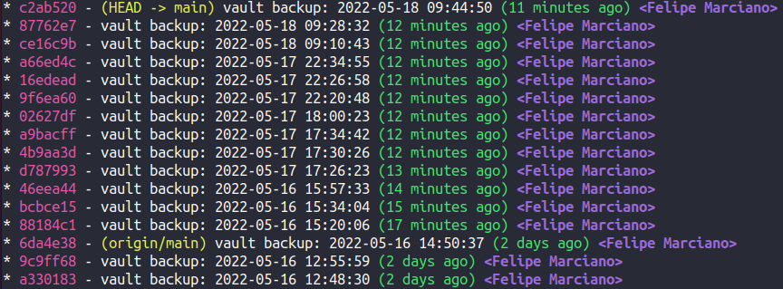

## O Problema

Você já commitou um arquivo muito grande por engano?  
Se sim, então você viu essa mensagem ao tentar dar um `push`:

```shell
remote: error: GH001: Large files detected. You may want to try Git Large File Storage - https://git-lfs.github.com.
remote: error: Trace: <hash>
remote: error: See http://git.io/iEPt8g for more information.
remote: error: File <nome-do-arquivo> is <X> MB; this exceeds GitHub's file size limit of 100.0 MB
```

E como a mensagem diz, o erro é gerado pelo arquivo ser maior do que o limite permitido de 100 Mb.

Na minha situação aconteceu utilizando o app [Obsidian](https://obsidian.md/) em conjunto com o plugin [obsidian-git](https://github.com/denolehov/obsidian-git) que permite configurar commits e push automáticos de tempos em tempos ou minutos após uma edição.

Ao fazer backup de algumas coisas copiei um `pdf` de uma pasta, joguei direto na pasta do Obsidian e continuei editando (e gerando commits).

Depois de um tempo a cena era essa abaixo, vários commits e um bom tempo sem um `push`.



## A Solução

> Obs: Essa não é a única abordagem possível ou mais correta mas sim a que melhor se encaixou para o meu problema.

Antes de começar a sentar o dedo no Terminal, vamos fazer uma cópia local da nossa branch.  
Estou trabalhando na `main`, portanto: `git checkout -b main-bkp`.  
Agora vamos voltar para nossa branch: `git checkout main`.

Analisando a imagem é possível perceber que os pushs pararam no commit `88184c1`, logo, nele existe um arquivo maior do que 100Mb.

Como confirmar isso? Vamos ver os arquivos do commit: `git diff-tree --no-commit-id --name-only -r 88184c1`

Eu sabia que estava procurando um `.pdf`, então também utilizei `grep` para filtrar os resultados: `git diff-tree --no-commit-id --name-only -r 88184c1 | grep pdf`

Confirmei que ele existia, fiz um `rebase --interactive`, removi do commit e o erro reapareceu porque tinha outro `pdf` maior que 100 MB, então vamos fazer o `rebase` no commit `46eea44` juntos.

### Rebase --interactive

Vamos rodar o `diff-tree` novamente, só para confirmar que nosso arquivo a ser removido (`Livro-Nao-Me-Faca-Pensar.pdf`) está no commit:

```
git diff-tree --no-commit-id --name-only -r 46eea44
```

O resultado foi esse:

```shell
professional/@research/design/_resources/05.2._Lista_de_livros.resources/Livro-Nao-Me-Faca-Pensar.pdf
professional/@research/design/_resources/UX Principios Basicos/nui-161119122039.pdf
```

Rebase:

```
git rebase --interactive '46eea44^'
```

A execução do comando nos levou para o momento no histórico onde os arquivos foram modificados mas não commitados.  
Em outras palavras, é hora de fazer as alterações, ou seja, remover o `pdf`.

Utilizo o VSCode, então digitei `code .`, entrei no editor e deletei o arquivo.

Agora vamos colocar essa modificação em `stage` para podermos commitar:

```
git add .
```

Commitamos com a flag `amend`:

```
git commit --amend
```

E procedemos com o rebase:

```
git rebase --continue
```

Se não ocorrerem conflitos, você pode prosseguir com um `push force` para atualizar a branch:

```
git push --force origin main
```

Se houverem conflitos, será necessário resolvê-los, commit por commit.  
Após cada `git rebase --continue`, abra seu editor de preferência, resolva o conflito, coloque o arquivo em stage e repita o processo com rebase.

### Referências:

- [How to modify a specified commit?](https://stackoverflow.com/questions/1186535/how-to-modify-a-specified-commit);
- [Overcoming GitHub Storage Limits](https://rewind.com/blog/overcoming-github-storage-limits/);
- [Como remover arquivos grandes do histórico do git](https://reinaldorauch.dev.br/como-remover-arquivos-grandes-do-historico-do-git);
