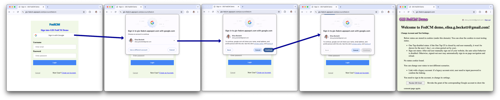
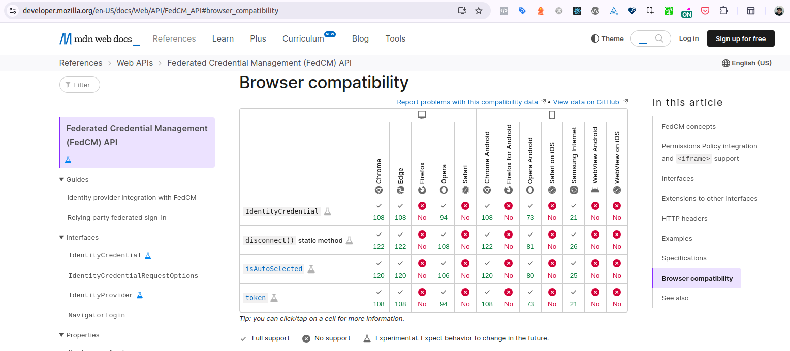

## Contextualização

Imagine o seguinte cenário: Surgiu a necessidade de atualização de scripts de login web com objetivo de diminuir a quantidade de erros no login e um dos principais meios de login social é o Google Sign In - exatamente, aquele botãozinho que abre uma janela de login do Google. Sem problemas até então.

Seu primeiro passo é ler a documentação do [Sign in with Google for Web](https://developers.google.com/identity/gsi/web/guides/overview?hl=pt-br).

O segundo passo é conferir como está a implementação atual e, para sua surpresa, ela está com o script atualizado [segundo a própria documentação](https://developers.google.com/identity/gsi/web/guides/get-google-api-clientid?hl=pt-br#load_the_client_library).

```
src="https://accounts.google.com/gsi/client" async
```

No entanto, seus usuários não estão recebendo a "nova experiência de login" como o Google prometeu.



Como lidar?

## O que é a FedCM API

Vamos dar dois passos para trás e falar sobre essa API se suma importância pra nossa análise.

**FedCM** significa _Federated Credential Management_ e existe uma API no browser para isso. Essa API fornece um mecanismo padrão para provedores de identidade (IdPs) disponibilizarem serviços de federação de identidade na web de forma a preservar a privacidade, **sem a necessidade de cookies e redirecionamentos de terceiros** - essa é a parte mais importante.

Então, podemos dizer que o Google é maravilhoso e está na vanguarda trilhando um caminho para uma web mais segura? Sim! Ruim é a maneira que está acontecendo neste caso 😅, vamos avançar.

### Compatibilidade do FedCM

A próxima etapa é dar uma olhada na [compatibilidade nos navegadores por meio da MDN Web Docs](https://developer.mozilla.org/en-US/docs/Web/API/FedCM_API#browser_compatibility).



Podemos observar que:

- Não temos suporte para Firefox, Safari e Webview no Android e iOS;
- No Chrome, somente a partir da versão 117 lançada oficialmente em 12 de setembro de 2023.

Esse é o momento que você deve se perguntar:

- Vale a pena o esforço?
- Será que falhas de login serão diminuídas com a nova implementação?
- Quais browsers o público utiliza pra acessar a plataforma? O risco é aceitável?
- Por que o Google confia numa API em estado experimental? Eu deveria confiar também?

### O que a W3C diz sobre o FedCM?

[No site oficial da W3C a proposta está com status First Public Working Draft](https://www.w3.org/TR/fedcm/).
O que indica que podem surgir mudanças em como ela é implementada.

A sequência pela W3C do processo é a seguinte:

- Working Draft (WD): Rascunho inicial, sujeito a mudanças. (onde está no momento)
- Candidate Recommendation (CR): Estável, aguardando implementações.
- Proposed Recommendation (PR): Pronto para revisão final.
- W3C Recommendation (REC): Padrão oficialmente aprovado.

Em outras palavras, está bem longe.

## Primeiras impressões

Então, o que podemos deduzir só de pesquisa até o momento, sem testes de implementação?

### Sobre o Google

Aparentemente o Google não se importa com as pessoas que utilizam browsers que tenham um motor diferente do Chromium e eles estão dispostos a fazer essa mudança mesmo sabendo que o FedCM é uma API em estado experimental. Uma conversa recente entre alguns usuários no Reddit sobre isso.

### Sobre a migração

[O próprio guia do FedCM Migration diz](https://developers.google.com/identity/gsi/web/guides/fedcm-migration?hl=pt-br#overview):

> Para a maioria dos sites, a migração ocorre sem problemas com atualizações compatíveis com versões anteriores para a biblioteca JavaScript dos Serviços de Identificação do Google.

- [Segundo a documentação](https://developers.google.com/identity/sign-in/web/gsi-with-fedcm?hl=pt-br#timeline), Agosto de 2025 será a adoção obrigatória das APIs FedCM pela biblioteca da plataforma do Login do Google. No entanto, essa data era Março e, eu sei porque tirei um screenshot exatamente dessa linha a um tempo atrás.
- A migração é progressiva e condicional à compatibilidade.
- A lógica nos leva a conclusão que navegadores sem suporte não podem simplesmente deixar de funcionar (haveriam inúmeros sites sem login).
- E que aos passos que grandes players como Safari e Firefox implementarem suporte a API, o Google irá interromper a disponibilização da versão antiga.

## A implementação

Agora chega de especulações, vamos a implementação.

### Seguindo a documentação

Se faz necessário passar os parâmetros corretos, então siga a documentação [Exibir o botão Fazer login com o Google](https://developers.google.com/identity/gsi/web/guides/display-button?hl=pt-br).

### Verificando métodos disponíveis no navegador

Quando fiz a implementação acabei colocando uma função de verificação de todos os métodos de API necessários para autenticação com FedCM. Ela retorna um booleano que utilizo para passar os parâmetros do FedCM ou não, conforme o caso.

```js
/**
 * Verify FedCM API browser support.
 * @see {@link https://developer.mozilla.org/en-US/docs/Web/API/FedCM_API MDN Documentation}
 * @returns {boolean}
 */
export const isFedCMApiAvailable = () => {
  return (
    "FederatedCredential" in window &&
    "IdentityCredential" in window &&
    "IdentityProvider" in window &&
    "NavigatorLogin" in window &&
    "CredentialsContainer" in window &&
    typeof window?.navigator?.login?.setStatus === "function"
  );
};
```

### Detalhes da implementação

Existem alguns detalhes de implementação que enfrentamos e temos que entender:

- O script do Google Sign exige que você tenha um ambiente `https`;
  - Isso dificulta o desenvolvimento local;
- O script também exige que você tenha uma `callbackUrl` cadastrada no GCP, que seja a mesma passada por meio de parâmetro no código e que seja a url do domínio sendo utilizado para testes;
- O domínio e subdomínio utilizados para testes também devem estar cadastrados;
  - `Localhost` também deve estar entre esses domínios. Se você não possui acesso, tente a sorte observando se o script localmente reconhece o `clientId` e efetua o login;
- O script deveria fornecer a opção de fallback nativamente caso a API FedCM não esteja disponível;
- A API FedCM torna-se ativa por padrão no Google Chrome a partir da versão 133;
  - O Chrome atualmente está na versão 136;
  - A API apesar de estar sendo utilizada pelo Google Chrome está em estado experimental e não aprovada pelos padrões da W3C;
- A maioria dos usuários os quais o navegador pôde ser reconhecido como Google Chrome (no meu caso) utilizam a versão 135 ou superior;
- O resultado esperado é que a implementação funcione em todos os browsers mais utilizados (Chrome, Firefox, Edge, Safari e Samsung Internet), que possuem diferentes implementações do FedCM (ou não possuem), seja no desktop ou mobile, em diferentes sistemas operacionais (Windows, Mac, Linux, iOS e Android), para usuários que tentam se logar tendo conta (efetua login) ou não (redireciona para cadastro);

### Tabela de resultados

| Plataforma | Navegador | Login (com conta) | Cadastro (sem conta) | Observações |
| ------ | ------ | ------ | ------ | ------ |
| Ubuntu | Chrome 130 | Sucesso | Erro |
| Ubuntu | Chrome 135 | Sucesso | Erro |
| Ubuntu | Firefox 138 | Erro | Sucesso |
| Android | Edge | - | Erro | 403 + loop de autenticação |
| Browser Stack | Safari | Error | Error |
| Android | Samsung Internet | Sucesso | Sucesso |
| Android | Opera | - | Sucesso |
| Android | Brave | - | Erro |

## Conclusão

No atual cenário, apesar da função de verificação alguns fluxos não funcionam como o esperado.

A consequência seria fricção para o usuário e aumento de erros de login, portanto, chegamos a conclusão que não é o momento para realizar essa implementação e essa decisão pode ser revisitada no futuro.
