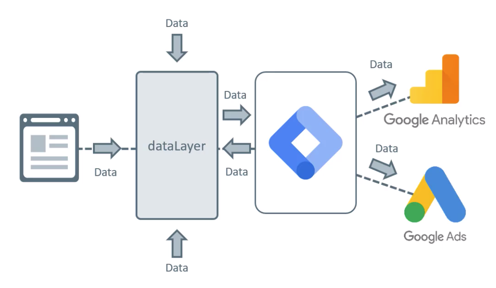
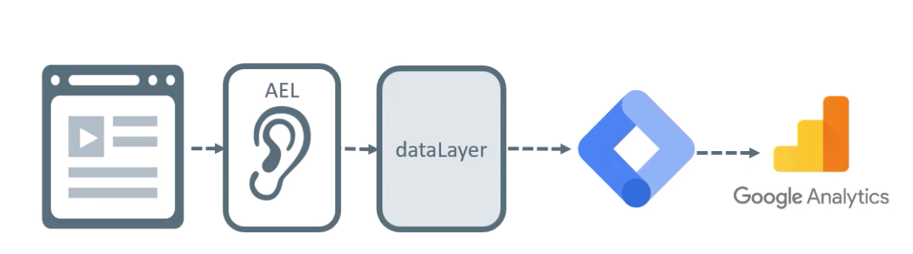

## Containers

Dentro das contas você pode criar vários `containers`.  
Se você tem familiaridade com o Google Analytics pode fazer a seguinte comparação: Os `containers` são a mesma coisa que as `propriedades`.

[O próprio Google não explica direito o que são containers](https://developers.google.com/tag-manager/api/v1/reference/accounts/containers?hl=pt), então vamos para um exemplo prático:

Imagine que você trabalhe na PepsiCo e a empresa necessite instalar o GTM nos sites dos produtos: Pepsi, Gatorade, H2OH! e Lipton.

O primeiro passo é entrar no site do [Google Tag Manager](https://tagmanager.google.com/) e criar uma conta com um container.

Só que em cada site/portal haverão estruturas de código, formulários e objetivos diferentes por parte da empresa.

Concorda comigo que ficaria uma bagunça se você implementasse o mesmo GTM em todos eles? Nesse momento entram em ação os `containers`.

- A conta que engloba tudo se chamaria: `PepsiCo`;
- Dentro desta conta, haveriam os containers: `Pepsi`, `Gatorade`, `H2OH!` e `Lipton`;
- Cada container teria seu código específico, por exemplo: `GTM-NJHF654`, `GTM-N2PFK50`, `GTM-ABC1234` e `GTM-0JKB87F`;
- Você implementaria cada um dos códigos em seus respectivos sites.

## Workspace (ou Espaço de trabalho)

Tendo uma conta gratuita (como a nossa), é possível ter simultaneamente até três `workspaces` e, para que eles servem?  
Imagine que você já tem algumas regras em produção no seu GTM e quer adicionar outras, porém, está com receio de quebrar tudo (quem nunca?), eis que surgem os `workspaces`.

Quando você cria um novo workspace, ele será uma cópia do seu Workspace Padrão (atual) e isso quer dizer que todo o conteúdo publicado até agora, será parte desse novo espaço de trabalho. Então, a partir daí, você poderá fazer alterações e visualizá-las tranquilamente. Quando terminar, basta `Publicar` as alterações e essa nova versão com suas modificações será a mais recente e ativa no site.

> Vídeo recomendado: [Google Tag Manager: Como adicionar e remover tags e scripts do seu site](https://www.youtube.com/watch?v=FECpDfHd_wU&list=PLjm8rxH__HzIFyEFDukCqTdWA3-oiSqRW&index=2)

## Tags (etiquetas), Triggers (acionadores) e Variables (variáveis)

- `Tags` (o quê) são pedaços de código que fazem algo, por exemplo, trackear uma página, enviar um evento para o Google Analytics ou plataformas de terceiros;
- `Trigger` (quando) é uma condição de quando uma tag deve ser disparada;
- `Variáveis` (o que/como/onde) são pequenos pedaços de informação que podem ser reutilizados em tags e gatilhos;

## Variables (variáveis) em detalhes

No painel lateral do GTM existe a opção `Variáveis` onde temos as `variáveis incorporadas` que permitem captar dados da página ao interagir com a mesma sem necessidade de código. Você pode ver todas elas clicando no botão `Configurar` e ativar as que lhe fazem sentido.

Por exemplo, `Click Text` é uma variável incorporada que permite captar o texto do elemento num evento de clique.  
Você pode criar uma tag, escolher o modelo `Google Analytics: Universal Analytics` e adicionar no rótulo (por exemplo) a variável, escrevendo: `{{Click Text}}`.

## Triggers (acionadores) em detalhes

No painel lateral do GTM existe a opção `Acionadores` que exibe uma lista vazia ao criar o container.  
Ao clicar no botão de Adicionar um novo acionador, uma tela é aberta e a primeira ação é escolher o `tipo de acionador`.  
A nomenclatura - pelo menos pra mim - causou estranheza no início mas faz total sentido ter um `tipo` dentro do seu acionador pois existem diversos contextos onde podem ser aplicados.

## Datalayer

Uma camada "invisível" onde informações importantes sobre a página, compra ou interação é armazenada.  
Ele pode receber informação de diversos modos e o GTM pode ser configurado para pegar essas informações do dataLayer e enviar para o Google Analytics, Google Ads ou algum outro.

Um possível cenário é o abaixo, onde ocorre uma interação, um Auto Event Listener está escutando, envia para o dataLayer e, então o GTM pega essa informação e passa para alguma ferramenta, GA, por exemplo.

## Créditos

- As imagens são de autoria do site [AnalyticsMania](https://www.analyticsmania.com/).
