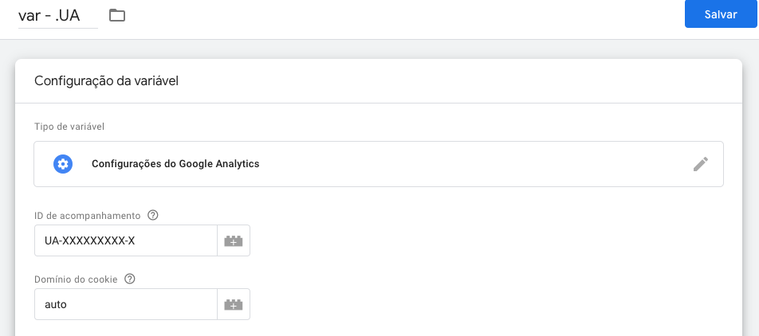
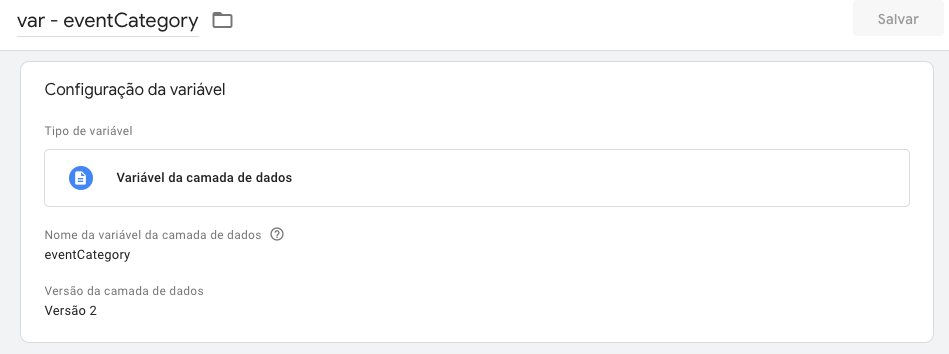
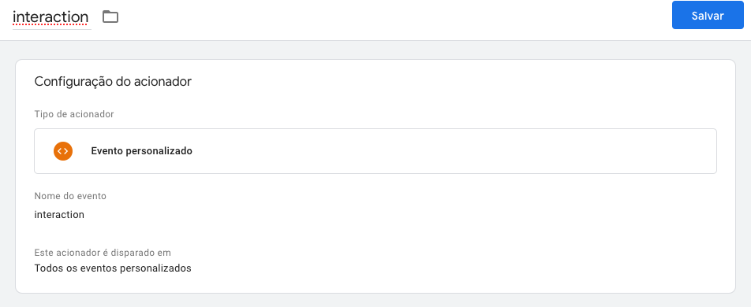
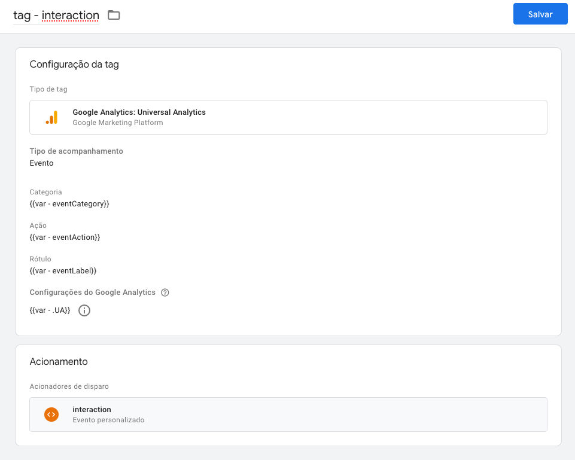
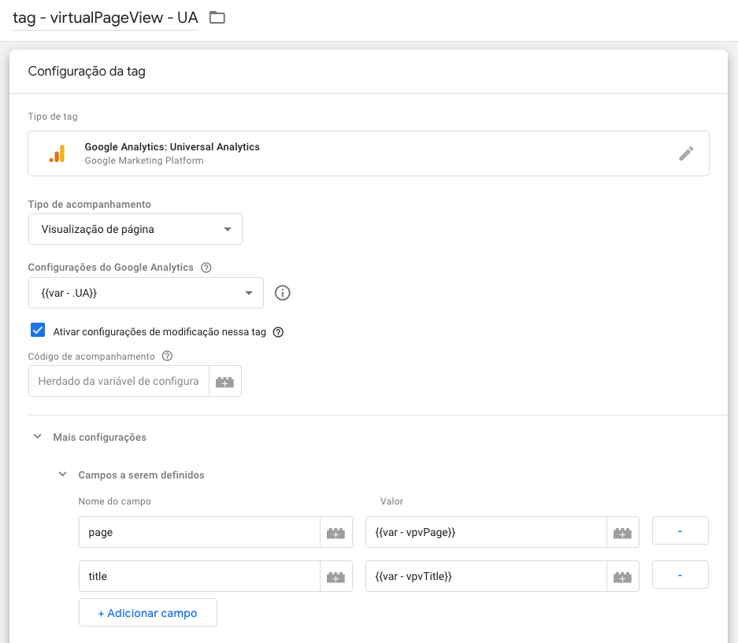

Vamos imaginar o cenário onde queremos disparar um evento chamado `interaction` quando o usuário interagir com alguns elementos específicos. Para isso será necessário criar um evento personalizado.

> Os eventos personalizados são usados para acompanhar as interações que ocorrem no seu site ou app para dispositivos móveis que não são tratadas pelos métodos padrão. O caso de uso mais comum é quando você quer monitorar envios de formulários, mas o comportamento padrão do formulário foi alterado (por exemplo, o evento de navegador submit foi modificado). - [Google Tag Manager](https://support.google.com/tagmanager/answer/7679219?hl=pt-BR)

Esse evento precisará ter uma categoria (`category`), ação (`action`) e rótulo (`label`). Usarei nomes que acredito serem intuitivos mas você pode nomear como quiser.

## Parte I - Configurações no GTM

1. Criar uma variável `var - .UA` de `Configurações do Google Analytics` (se não houver) para que possamos enviar as informações capturadas para a conta do GA;



2. Criar as seguintes [Variáveis de camada de dados](https://support.google.com/tagmanager/answer/6164391?hl=pt-BR#:~:text=Configurar%20a%20vari%C3%A1vel%20da%20camada,de%20dados%20como%20o%20tipo.): `eventCategory`, `eventAction` e `eventLabel`



3. Criar um acionador(`trigger`) que será um `Evento personalizado` chamado `interaction` e será disparado em `Todos os eventos personalizados`.



4. Por fim, criar uma tag chamada `interaction` com:
   - `Evento` no campo "Tipo de acompanhamento";
   - `eventCategory` no campo "Categoria";
   - `eventAction` no campo "Ação";
   - `eventLabel` no campo "Rótulo";
   - Nossa variável de Universal Analytics `var - .UA` no campo "Configurações do Google Analytics";
   - E, nosso acionador `interaction` no campo "Acionadores de Disparo";



5. Clique no painel lateral esquerdo em "Visão Geral", confira se as alterações estão na lista "Alterações no espaço de trabalho" e em "Visualizar" para ativar o `Preview` ou "Enviar" para publicar as alterações.

## Parte II - Disparando o evento via código

Naturalmente existe toda uma [documentação sobre datalayer (ou Camada de Dados)](https://developers.google.com/tag-manager/devguide?hl=pt_br) e [eventos personalizados](https://support.google.com/tagmanager/answer/7679219?hl=pt-BR) escrita pelo Google e que aconselho a leitura posteriormente. No momento vamos continuar nessa levada.

Considerando que sua página já possua o código de implementação do Google Tag Manager no `<head>` conforme pede a documentação, o próximo passo é iniciar o dataLayer:

```jsx
window.dataLayer = window.dataLayer || [];
```

Sim, essa única linha iniciou o dataLayer. A princípio ele não é mais nada do que um array vazio.  
A medida que os eventos acontecem nós vamos dando `pushs` e com as configurações que fizemos no GTM, ele cuida do resto.

É importante dizer que o dataLayer deve ser iniciado uma vez por página, portanto, essa linha deve aparecer uma única vez e não ser executada a cada interação. Se ao trocar de rota numa Single Page Application você quer indicar que uma nova página foi carregada, vai precisar criar um evento pra isso.

Se você está lidando com **Javascript puro**, para garantir que esta linha só seja executada após o carregamento do script do GTM, pode disparar este código na [função onload](https://developer.mozilla.org/pt-BR/docs/Web/API/GlobalEventHandlers/onload) da página ou utilizar [document.onreadystatechange](https://developer.mozilla.org/pt-BR/docs/Web/API/Document/readyState).

**Com jQuery** você tem o [evento load](https://api.jquery.com/load-event/): `$(window).on('load', function() {});` ou `$( window ).load(function() {});`

**Com React** temos algumas opções, se você está lidando com uma Single Page Application comum ( `create-react-app` ou similar ), a primeira proposta é ao iniciar seu componente:

```jsx
const SeuComponente = () => {
  window.dataLayer = window.dataLayer || [];
};
```

Se você está usando SSR (Server-side rendering) com NextJS, por exemplo, pode ser que você tenha problemas com o objeto `window` não sendo encontrado porque ele não existe a não ser que você esteja no browser, sendo assim:

```jsx
const SeuComponente = () => {
  let datalayerComponent = null;
  if (typeof window === "undefined") {
    datalayerComponent = [];
  } else {
    datalayerComponent = window.dataLayer ? window.dataLayer : [];
  }
};
```

Chegamos no momento de disparar o evento, imagine que vamos utilizar esse evento genérico num botão de cadastro, então quando o botão for clicado, ANTES de redirecionar a pessoa, ocorrerá um push para o datalayer. Vejamos como fica:

```js
<button
  onClick={(e) => {
    e.preventDefault();
    datalayerComponent.push({
      event: "interaction",
      eventCategory: "cadastro:usuario",
      eventAction: "clicou:concluir-cadastro",
      eventLabel: "pt-BR",
      eventValue: 0,
    });
    window.location.href = "<URL_DE_DESTINO>";
  }}
>
  Concluir cadastro
</button>
```

No exemplo acima, estamos enviando a categoria `cadastro:usuario` mas poderia ser `cadastro:empresa`, somente `cadastro` ou o que você quiser. A mesma ideia pode ser aplicada para o `eventAction`.

Além disso, no `eventLabel` estou enviando o idioma que o usuário fez o cadastro e, que neste contexto é uma informação importante para mim.

O `eventValue` deixei `0` pois não utilizo-o.

## virtualPageView

No artigo [Google Tag Manager - Parte 1: O que é e como instalar](/gtm-parte-1-o-que-e-como-instalar), foi mencionado um evento personalizado que demos o nome de `virtualPageView` para sinalizar a troca de rota em Single Page Applications.

O cadastro desse evento segue a mesma lógica da **Parte I - Configurações no GTM** com pequenas alterações.

1. Criação da variável de camada de dados `vpvPage` (virtualPageViewPage);
2. Criação da variável de camada de dados `vpvTitle` (virtualPageViewTitle);
3. Criação do acionador `virtualPageView` disparado em `Todos os eventos personalizados`;
4. Criação da tag `virtualPageView` como mostrado abaixo.


