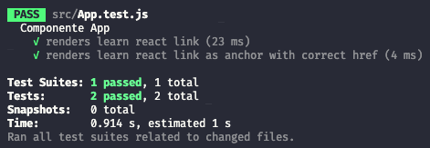

## **Introdução**

Se você chegou aqui, não tenho dúvidas que você sabe o que são testes unitários e sua importância, sendo assim, vou te deixar com dois parágrafos muito bons sobre testes automatizados para aplicações em React e logo em seguida vamos pro código.

> Quando escrevemos testes automatizados para aplicações em React, provavelmente uma grande parte dos nossos testes será sobre algum componente de UI e não apenas funções de regras de negócio. Por isso, precisamos de uma biblioteca que nos auxilie a interagir com o DOM, renderizando e encontrando os elementos que precisamos verificar nos testes.
> 
> A React Testing Library surgiu com uma abordagem centrada no usuário e com padrões para enfatizar boas práticas de semântica e acessibilidade. E hoje já faz parte do pacote padrão de uma aplicação feita com o Create React App. - [Eduarda Scharnhorst](https://www.linkedin.com/in/dudaschar/) em _React: Automatizando os testes em aplicações front-end._


## **Mão na massa**

Imagine que você acabou de gerar uma aplicação com o CLI: Create React App.  
Se você não sabe como fazer isso, [visite a documentação clicando aqui](https://pt-br.reactjs.org/docs/create-a-new-react-app.html#create-react-app).

A aplicação terá um arquivo `src/App.js` com a seguinte estrutura HTML(JSX):

```jsx
<div className="App">
  <header className="App-header">
    
    <p>
      Edit <code>src/App.js</code> and save to reload.
    </p>
    <a
      className="App-link"
      href="https://reactjs.org"
      target="_blank"
      rel="noopener noreferrer"
    >
      Learn React
    </a>
  </header>
</div>
```

E já terá um teste dentro do arquivo `src/App.test.js`. É importante explicar aqui que o `nome do componente` + `.test` dentro do mesmo diretório é uma convenção/boa prática pois a localização do teste fica mais intuitiva e não temos problemas de paths enormes em nossos imports.

Exemplificando, se você tem uma pasta chamada `UI` e dentro dela o componente `Header.js` seu teste será `Header.test.js`.  
Outro uso comum seria ter uma pasta chamada `Header` e dentro dela o arquivo `index.js`, nesse caso seu arquivo de teste continuaria sendo `Header.test.js`, só mudaria o caminho do `import`; 


## **Analisando o código**

Vamos dar uma olhada no código inicial dentro de `src/App.test.js`.

```javascript
import { render, screen } from '@testing-library/react';
import App from './App';

test('renders learn react link', () => {
  render(<App />);
  const linkElement = screen.getByText(/learn react/i);
  expect(linkElement).toBeInTheDocument();
});
```

## **Passo a passo**

<div class="fx-group">

> `import { render, screen } from '@testing-library/react';`

Estamos importando os métodos `render` e `screen`.

`render` é o método que permitirá renderizarmos nosso componente.  
Imagine que você tem uma página vazia, logo, qualquer comando de teste rodado vai dar erro, correto?  
Então, quando o `render` é chamado, ele renderiza o componente dentro desta página e estamos prontos para iniciar o teste.

`screen` é um método que possui `queries` dentro dele.  
Isso quer dizer que usaremos funções/métodos que estão dentro de `screen` para capturar as informações que queremos.  
Já vamos chegar lá nas próximas linhas.
</div>

<div class="fx-group">

  > `import App from './App';`

  Importando nosso componente. Sem novidades.
</div>

<div class="fx-group">

  > `test('renders learn react link', () => {`

  `test` - que também pode ser encontrado como `it` -, é o método que nos permite escrever um texto descrevendo o que um teste bem sucedido deve fazer. No nosso exemplo, `renderiza o link "learn react"`
</div>

<div class="fx-group">

> `render(<App />);`

Renderizando o componente `App`.
</div>

<div class="fx-group">

> `const linkElement = screen.getByText(/learn react/i);`

Atribuindo à constante `linkElement` a `query`(método) `getByText` que deve encontrar o elemento que possui o texto `/learn react/i`.

O trecho `/learn react/i` é um padrão regex que desabilita o `case-sensitive`, ou seja, ignora a diferença entre letras maiúsculas e minúsculas. Puro Javascript.

Lembrando que para selecionar elementos você pode continuar utilizando o bom e velho `querySelector`, por exemplo: `const foo = container.querySelector('[data-foo="bar"]')`.
</div>

<div class="fx-group">

> `expect(linkElement).toBeInTheDocument();`

`expect` é um comando que faz asserções. O que é isso?  
Uma asserção pega um valor booleano (true || false) e sempre espera que o retorno seja `true`. Se o evento retornar falso, o teste falha.

Para exemplificar melhor, a linha acima também poderia ser escrita assim:  
`expect(screen.getByText(/learn react/i)).toBeInTheDocument();`

`toBeInTheDocument()` é um matcher. O que é isso?  
É uma função cujo valor resultante deve ser `true` em relação ao que está testando do `expect`. Neste caso é `estarNoDocumento`. Existe inclusive uma lista de matchers e [você pode encontrá-la aqui](https://jestjs.io/docs/en/expect.html#content).
</div>

## **Dificultando as coisas**

Vamos realizar algumas alterações para podermos abordar outros métodos e discutir:

```javascript
import { render, screen } from '@testing-library/react';
import App from './App';

describe('Componente App', () => {
  it('renders learn react link', () => {
    render(<App />);
    const linkElement = screen.getByText(/learn react/i);
    expect(linkElement).toBeInTheDocument();
  });
  it('renders learn react link as anchor', () => {
    render(<App />);
    const linkElement = screen.getByText(/learn react/i);
    expect(linkElement).toHaveAttribute('href');
  });
});
```

`describe` é um método opcional que você pode utilizar para envelopar um conjunto de testes. Aqui estamos utilizando para delimitar os testes do nosso componente `App` e a resposta ao rodar os testes fica da seguinte maneira:



`it`, como falamos anteriormente está substituindo o `test` e pela minha experiência pessoal é o método mais utilizado no mercado.

<div class="fx-group">

> `it('renders learn react link as anchor', () => {`

`renders learn react link as anchor`, novo teste, dessa vez, testaremos se o elemento é um link
</div>
<div class="fx-group">

> `expect(linkElement).toHaveAttribute('href');`

`toHaveAttribute('href')`, conferindo se o elemento tem um href.  
</div>

## **E qual é o problema que temos aqui?**

O teste vai passar com qualquer elemento que tenha um `href`, por exemplo, se for uma `div` o teste vai retornar com sucesso.  
O correto seria:

```javascript
it('renders learn react link as anchor', () => {
  render(<App />);
  // adicionando `.closest('a')`
  const linkElement = screen.getByText(/learn react/i).closest('a');
  expect(linkElement).toHaveAttribute('href');
});
```

Então esse último tópico foi gratuito só para chamar atenção em como você realiza seus testes e mostrar que 100% de cobertura não quer dizer uma aplicação sem bugs. :)

## **Referências**

- [Testing in React with Jest and Enzyme: An Introduction](https://medium.com/@rossbulat/testing-in-react-with-jest-and-enzyme-an-introduction-99ce047dfcf8);
- [JEST Expect](https://jestjs.io/docs/en/expect.html#tobevalue);
- [How to test anchor's href with react-testing-library](https://stackoverflow.com/questions/57827126/how-to-test-anchors-href-with-react-testing-library);
- [Crie um novo React App](https://pt-br.reactjs.org/docs/create-a-new-react-app.html).
