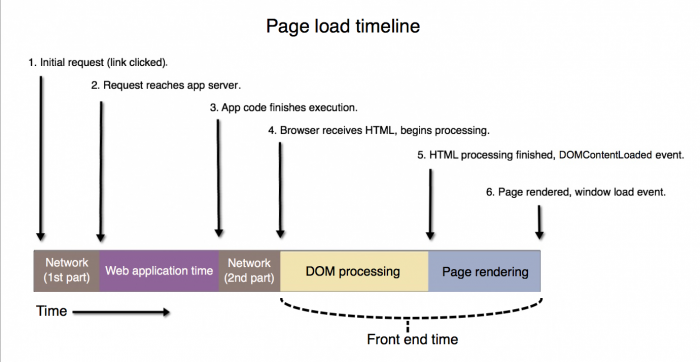
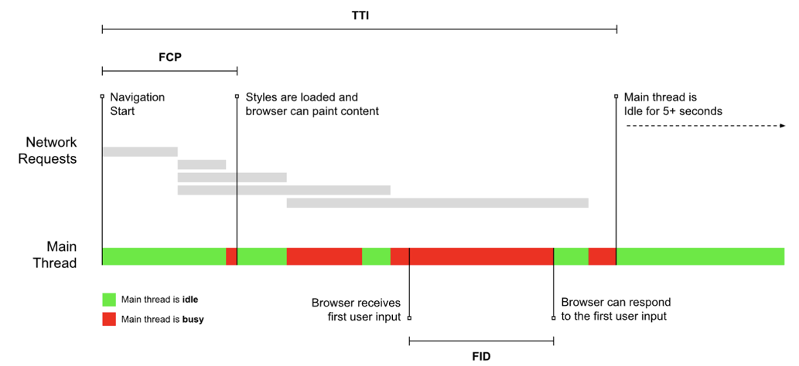
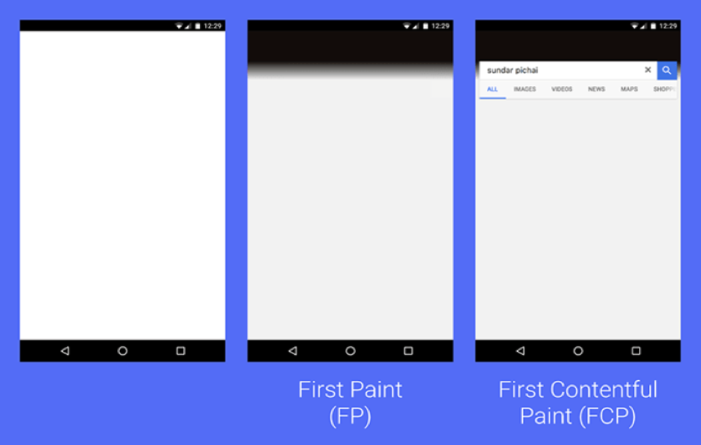

> **[New Relic Browser: Tracking User Experience with First Paint and First Contentful Paint Metrics](https://newrelic.com/blog/how-to-relic/browser-first-paint-first-contentful-paint)**  
> Em um blog post chamado [Web Page Usability Matters](https://addyosmani.com/blog/usability/), o Gerente de Engenharia do Google Chrome  [Addy Osmani](https://addyosmani.com/blog/) escreveu, “Carregar uma página é uma jornada progressiva com quatro momentos chaves: Está acontecendo? É útil? É usável? E é agradável?

As páginas web estão mais dinâmicas do que nunca e uma única métrica não é o suficiente para entender a performance e experiência do usuário final.

Este post tem por objetivo misturar a explicação de conceitos envolvendo carregamento de páginas web, métricas de experiência do usuário e sua importância, atrelado a como extrair essas métricas do New Relic.

Lembrando que o objetivo não é ensinar a mexer na plataforma do New Relic, portanto, vou considerar que você sabe o que é um Dashboard, como criar um gráfico (chart) e tem noções de NRQL (New Relic Query Language) que é a "linguagem SQL do New Relic".

### Etapas gerais de carregamento de uma página web



Lista de etapas de `page load timeline` presentes na imagem:

1. Requisição inicial (link foi clicado);
2. Requisição bate no servidor da aplicação;
3. O código da aplicação finaliza a execução;
4. Navegador recebe HTML e inicia o processamento;
5. Processamento HTML é finalizado e disparado o evento `DOM Content Load`;
6. Finalmente, a página é totalmente renderizada e o evento `window load` é disparado;

Durante esse processo, muito coisa pode acontecer, sendo assim, é bom ter em mente que a velocidade o qual seu site será renderizado depende de diversas variáveis, tais como:

- A velocidade de internet;
- A capacidade de processamento do dispositivo sendo utilizado;
- A localização do servidor;
- Quantos usuários estão tentando acessar o site;
- O nível de otimização do site da web, apenas para citar alguns desses fatores;

Então, vejamos algumas métricas clássicas de carregamento.

### Métricas de Carregamento
`Loading Metrics`

Métricas tradicionais como `DOM Content Loaded` e `Page Load` (historicamente medida pelo evento de `window.load`) por si só são pouco efetivas para monitorar sites modernos. No entanto, não podemos descartar sua importância e as oportunidades de melhoria que nos trazem ao serem analisadas. Vejamos brevemente como cada uma funciona.

#### DOM Content Loaded
> **[Document: DOMContentLoaded event](https://developer.mozilla.org/en-US/docs/Web/API/Document/DOMContentLoaded_event)**  
> O evento DOMContentLoaded é disparado quando o documento HTML inicial foi completamente carregado e parseado, sem esperar por estilos, imagens e subframes finalizarem seu carregamento.

####  Page Load (Window load + AJAX)
> **[Window: load event](https://developer.mozilla.org/en-US/docs/Web/API/Window/load_event)**  
> O evento `load` é disparado quando uma página está totalmente carregada, incluindo os recursos dependentes como estilos, scripts, iframes e imagens. É diferente do DOM Content Loaded que dispara sem esperar pelos recursos finalizarem seus carregamentos.

E agora, vamos ver como podemos criar gráficos no New Relic que nos auxiliem a mensurar essas informações. 

#### Page Load
Vamos criar um histograma baseado na duração do tempo do evento `Pageview` pegando dados de uma semana para termos uma base consistente onde a url contém `www.teste.com.br`

```sql
SELECT histogram(duration, width: 10, buckets: 20) 
FROM PageView
SINCE 1 week ago
WHERE pageUrl LIKE '%www.teste.com.br%'
```

> **O que é um histograma**  
> Um histograma é similar a um gráfico de barras, porém, cada barra representa um intervalo ao invés de um número específico. [Histogram charts](https://docs.newrelic.com/docs/apm/apm-ui-pages/monitoring/response-time-chart-types-apm-browser/#histogram) mostram o response time distribuído em um período selecionado de tempo. O New Relic intencionalmente corta a porcentagem da amostragem para 95% visto que esses 5% restantes são exceções (requisições aleatórias que tomaram muito tempo) e poluiriam as estatísticas.

No exemplo abaixo apesar da função utilizada de `histogram` criamos um `heatmap` das mesmas informações só que agora por categorizadas por url.

`Page Load By Url`
```sql
SELECT histogram(duration, width: 10, buckets: 20)
FROM PageView 
SINCE 1 week ago
WHERE pageUrl LIKE '%www.teste.com.br%'
FACET pageUrl
```

Lembrando que a duração ([duration](https://docs.newrelic.com/attribute-dictionary/?event=PageView&attribute=duration)) do tempo de carregamento da página no New Relic é calculada desde quando o usuário clica num hyperlink até que a página esteja totalmente carregada e dispare o evento `window load event` ( `Navigation Timing API loadEventEnd` menos `navigationStart`).

`Slowest Page Loads`
```sql
SELECT max(duration)
FROM PageView
WHERE appName = 'MVC-Frontend (GCP)' AND pageUrl LIKE '%www.magazinevoce%' 
FACET pageUrl 
SINCE 1 week ago LIMIT 50
```

> **Atenção**  
> Por empirismo percebi que a propriedade `appName` apesar de estar disponível não funciona bem com queries por `PageView`. A melhor opção é fazer um `WHERE` com `pageUrl`s da aplicação ou utilizar ambas as condições.

Métricas de performance centradas no usuário são críticas para os times de desenvolvimento frontend que desejam mensurar e melhorar a experiência dos clientes.

### Métricas de Performance Percebida
`User Centric Perceived Performance metrics`

Métricas que identificam a "performance percebida" podem trazer luz em relação a essa experiência do usuário e ajudar a entender o quão rápido as páginas estão carregando. Essas métricas ajudam a responder a pergunta: "Quanto tempo passa antes do usuário ver o conteúdo?"

A seguir temos ilustração de google.developer.com que mostra a relação entre firstInputDelay, firstInteraction (ou TTI), firstContentfulPaint, e a thread principal do browser. (Creative Commons Attribution 4.0 License)



Falando sobre `Paint` é bom deixarmos claro que o New Relic se baseia na `PerformancePaintTiming API` e que por sua vez não está disponível em todos os browsers, como mostra o site Can I Use ( [PerformancePaintTiming API](https://caniuse.com/?search=PerformancePaintTiming) ).

#### First Paint
First Paint é o tempo entre a navegação e quando o navegador renderiza o primeiro pixel na tela, renderizando qualquer coisa que é visualmente diferente do background color padrão do body.

É possível extrair essas informações do `Pageview` no entanto a documentação do New Relic aconselha utilizar o `PageViewTiming`: [PageViewTiming - Async or dynamic page details](https://docs.newrelic.com/docs/browser/new-relic-browser/page-load-timing-resources/pageviewtiming-async-or-dynamic-page-details/).

`First Paint`
```sql
SELECT histogram(firstPaint, 10, 20)
FROM PageViewTiming
SINCE 24 hours ago
WHERE pageUrl LIKE '%www.magazinevoce%'
```

`First Paint by url`
```sql
SELECT histogram(firstPaint,10,20) 
FROM PageViewTiming 
SINCE 1 week ago 
WHERE appName = 'MVC-Frontend (GCP)' AND pageUrl LIKE '%www.magazinevoce%'
FACET pageUrl
```

`Median First Paint times by browser`
```sql
SELECT percentile(firstPaint, 50) 
FROM PageViewTiming
SINCE 1 week ago 
WHERE appName = 'MVC-Frontend (GCP)' AND pageUrl LIKE '%www.magazinevoce%'
FACET userAgentName
```

`Median First Paint by browser and agent`
```sql
SELECT percentile(firstPaint, 50) 
FROM PageViewTiming
SINCE 1 week ago 
WHERE appName = 'MVC-Frontend (GCP)' AND pageUrl LIKE '%www.magazinevoce%'
FACET userAgentName, userAgentVersion
```

`Median First Paint times from Microsoft Edge by Url`
```sql
SELECT percentile(firstPaint, 50) 
FROM PageViewTiming
SINCE 1 week ago 
WHERE appName = 'MVC-Frontend (GCP)' AND pageUrl LIKE '%www.magazinevoce%' AND userAgentName = 'Microsoft Edge'
FACET pageUrl
```


#### First Contentful Paint
First Contentful Paint ocorre quando o navegador renderiza qualquer conteúdo do DOM, incluindo qualquer texto, imagem, canvas ou svg. A imagem abaixo ilustra esse conceito:



Google developer guide: [User-centric Performance Metrics](https://developers.google.com/web/fundamentals/performance/user-centric-performance-metrics)

> **[Why only consider the first input delay metric - Google Web Dev](https://web.dev/fid/#why_only_consider_the_first_input)**  
> A primeira impressão que os usuários têm de quão rápido seu site carrega pode ser medida com a [First Contentful Paint (FCP)](https://web.dev/fcp/). Mas a rapidez com que seu site pode renderizar pixels na tela é apenas parte da história. Igualmente importante é a capacidade de resposta do seu site quando os usuários tentam interagir com esses pixels!

`Median paint and load times`
```sql
SELECT percentile(timeToResponseStart, 50) AS 'first byte', percentile(firstPaint, 50) as 'First paint', percentile(firstContentfulPaint, 50) as 'First contentful paint' ,  percentile(timeToDomContentLoadedEventEnd, 50) AS 'DOM content loaded', percentile(duration, 50) AS 'Window load + AJAX'
FROM BrowserInteraction
SINCE 2 days ago UNTIL now
WHERE appName = 'MVC-Frontend (GCP)'
TIMESERIES
```

`Median firstContentfulPaint with historical performance`
```sql
SELECT percentile(firstContentfulPaint, 50) as 'First contentful paint'
FROM BrowserInteraction
WHERE appName = 'MVC-Frontend (GCP)'
SINCE 1 day ago
COMPARE WITH 2 days ago
TIMESERIES 
```

#### Largest Contentful Paint

Quando estamos falando de performance de carregamento de página nenhuma métrica conta a história como um todo. A métrica LCP é provavelmente uma das mais representativas quando falamos de performance percebida de um site em RUM (`Real User Monitoring`). É confiável, consistente e fácil de entender.

> **[Web.dev](https://web.dev/optimize-lcp/)**  
> [Largest Contentful Paint](https://web.dev/lcp) - LCP (maior renderização de conteúdo) é uma métrica [Core Web Vitals](https://web.dev/vitals/) e mede quando o maior elemento de conteúdo na janela de visualização se torna visível. Ela pode ser usada para determinar quando o conteúdo principal da página terminou de ser renderizado na tela.

- É considerado bom até 2.5 segundos; 
- Necessita de melhorias a partir de 2.6 até 4.0 segundos; 
- E está ruim a partir de 4.1 segundos.

`Largest Contentful Paint`
```sql
SELECT percentile(largestContentfulPaint, 75)
FROM PageViewTiming
WHERE appName = 'MVC-Frontend (GCP)' AND timingName = 'largestContentfulPaint' SINCE 1 week ago
```

`Largest Contentful Paint by Experience`
```sql
SELECT percentage(count(*), WHERE largestContentfulPaint < 2.5) AS 'good', percentage(count(*), WHERE largestContentfulPaint >= 2.5 and largestContentfulPaint < 4) AS 'needs improvement', percentage(count(*), WHERE largestContentfulPaint >= 4) AS 'poor' 
FROM PageViewTiming 
WHERE appName = 'MVC-Frontend (GCP)' AND timingName = 'largestContentfulPaint' SINCE 1 week ago
```

`Largest Contentful Paint by Url`
```sql
SELECT percentile(largestContentfulPaint, 75)
FROM PageViewTiming
WHERE appName = 'MVC-Frontend (GCP)' AND timingName = 'largestContentfulPaint' AND pageUrl LIKE '%www.magazinevoce%'
FACET pageUrl
SINCE 1 week ago
```

`Largest Contentful Paint by Browser`
```sql
SELECT percentile(largestContentfulPaint, 75)
FROM PageViewTiming
WHERE appName = 'MVC-Frontend (GCP)' AND timingName = 'largestContentfulPaint' AND pageUrl LIKE '%www.magazinevoce%'
FACET userAgentName
SINCE 1 week ago
```

### Métricas de interação
`Interactivity metrics`

Métricas de interação auxiliam a medir e melhorar a experiência do usuário evidenciando pontos como:

- Quão rápido os usuários podem interagir com conteúdo após o site renderizar;
- Quão rápido os usuários recebem uma resposta após interagir com conteúdo;
- Como elementos do seu site afetam a interação do usuário em diferentes dispositivos, navegadores e versões de navegadores. 

#### First Interaction
First Interaction captura o momento que o usuário engaja pela primeira vez com o site, essa interação pode ser do tipo: `click`, `keydown`, `mousedown`, `pointerdown` e `touchstart`  (desconheço a existência de outros). 

Esse timestamp representa o primeiro passo no cálculo do `First Input Delay`, que é o tempo da primeira interação ( `First Interaction` ) até o momento que o site responde (is interactive).

Para determinar se certas interações performam melhor do que outras, podemos utilizar a query abaixo.

`Median firstInteraction by interactionType`
```sql
SELECT percentile(firstInteraction, 50)
FROM PageViewTiming
WHERE appName = 'MVC-Frontend (GCP)'
FACET interactionType
```

Para encontrar padrões que determinem o quão cedo os usuários interagem com o conteúdo depois dele estar visível na página, podemos seguir com o exemplo abaixo.

`Median firstInteraction compared to firstPaint and firstContentfulPaint`
```sql
SELECT percentile(firstContentfulPaint, 50), percentile(firstPaint, 50), percentile(firstInteraction, 50)
FROM PageViewTiming
WHERE appName = 'MVC-Frontend (GCP)'
SINCE 2 days ago 
TIMESERIES 
```


#### First Input Delay
First Input Delay mede o tempo entre o usuário interagir com o site e o mesmo responder. O usuário pode, por exemplo, ter clicado em algo e o navegador com a main thread ocupada,  carregando um arquivo Javascript enorme e impossibilitado de responder.

Em outras palavras, a ideia que seu código rodará imediatamente após um evento é falsa.

> **[Why only consider the first input delay metric - Google Web Dev](https://web.dev/fid/#why_only_consider_the_first_input)**  
> First Input Delay (FID), ou Atraso da Primeira Entrada, é uma métrica importante e centrada no usuário para medir a [responsividade do carregamento](https://web.dev/user-centric-performance-metrics/#types-of-metrics) porque quantifica a experiência que os usuários sentem ao tentar interagir com páginas que não respondem: uma FID baixa ajuda a garantir que a página seja [utilizável](https://web.dev/user-centric-performance-metrics/#questions).

> **[Why only consider the first input delay metric - Google Web Dev](https://web.dev/fid/#why_only_consider_the_first_input)**  
> Para fornecer uma boa experiência ao usuário, os sites devem se esforçar para ter uma First Input Delay de **100 milissegundos** ou menos. Para garantir que você está atingindo essa meta para a maioria de seus usuários, um bom limite para medir é o **75º percentil** de carregamentos de página, segmentado em dispositivos móveis e desktop.

Para determinar se certas interações performam melhor que outras podemos utilizar a query abaixo:

`Median firstInputDelay by interactionType`
```sql
SELECT percentile(firstInputDelay, 50)/1000
FROM PageViewTiming
SINCE 1 day ago 
TIMESERIES 
FACET interactionType
```

Encontre a diferença de performance por navegador e versão:

`Median firstInputDelay by Browser/version`
```sql
SELECT percentile(firstInputDelay, 50)/1000
FROM PageViewTiming
WHERE appName = 'MVC-Frontend (GCP)'
SINCE 1 day ago
TIMESERIES
FACET userAgentName, userAgentVersion 
```

  
### Métricas de estabilidade visual
`Visual Stability metrics`

#### Cumulative Layout Shift
Mede o quanto os elementos de uma página se movem ou alteram seus tamanhos afetando o posicionamento dos conteúdos ao seu redor.

`Cumulative Layout Shift`
```sql
SELECT percentile(cumulativeLayoutShift, 75)
FROM PageViewTiming
WHERE appName = 'MVC-Frontend (GCP)' AND timingName = 'pageHide'
SINCE 1 week ago
```

`Cumulative Layout Shift by Experience`
```sql
SELECT percentage(count(*), WHERE cumulativeLayoutShift < 0.1) AS 'good', percentage(count(*), WHERE cumulativeLayoutShift >= 0.1 AND cumulativeLayoutShift < 0.25) AS 'needs improvement', percentage(count(*), WHERE cumulativeLayoutShift >= 0.25) AS 'poor', percentage(count(*), WHERE cumulativeLayoutShift is null) AS 'unknown' 
FROM PageViewTiming 
WHERE appName = 'MVC-Frontend (GCP)' AND timingName = 'pageHide' 
SINCE 2 week ago
```


## Demais referências

- [Heatmaps and Histograms](https://newrelic.com/blog/how-to-relic/heatmaps-histograms)
- [Page load timing process](https://docs.newrelic.com/docs/browser/new-relic-browser/page-load-timing-resources/page-load-timing-process/)
- [Measuring large contentful paint for browsers](https://newrelic.com/blog/best-practices/measuring-large-contentful-paint-for-browsers)
- [Optimize LCP](https://web.dev/optimize-lcp/)
- [Renderização do lado do client e do lado do servidor: Por que as coisas não são exatamente assim](https://www.freecodecamp.org/portuguese/news/renderizacao-do-lado-do-client-do-lado-do-servidor-por-que-as-coisas-nao-sao-exatamente-assim)
- [Missed First Paint and First Contentful Paint](https://discuss.newrelic.com/t/missed-first-paint-and-first-contentful-paint/88591)
- [Query to get top 10 slow URL](https://discuss.newrelic.com/t/query-to-get-top-10-slow-url/71813)
- [New Relic Browser: Tracking User Experience with First Paint and First Contentful Paint Metrics](https://newrelic.com/blog/how-to-relic/browser-first-paint-first-contentful-paint)
- [Monitor frontend performance with user-centric performance metrics in New Relic](https://newrelic.com/blog/nerdlog/monitor-frontend-performance-with-user-centric-performance-metrics)
