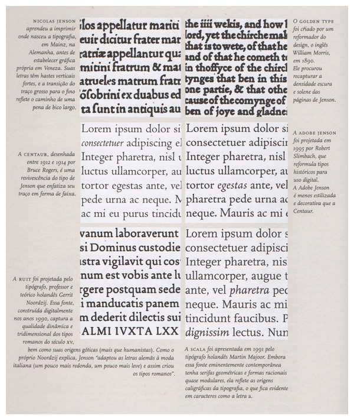
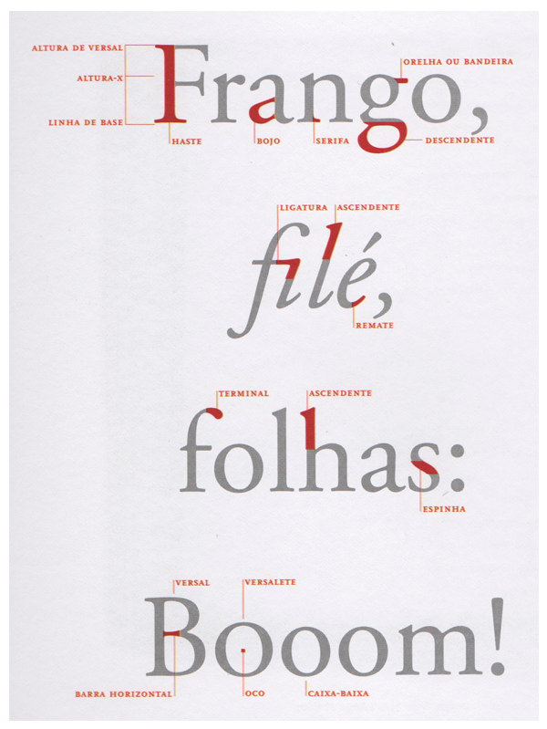
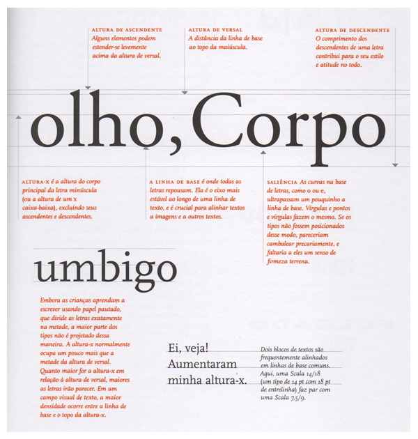
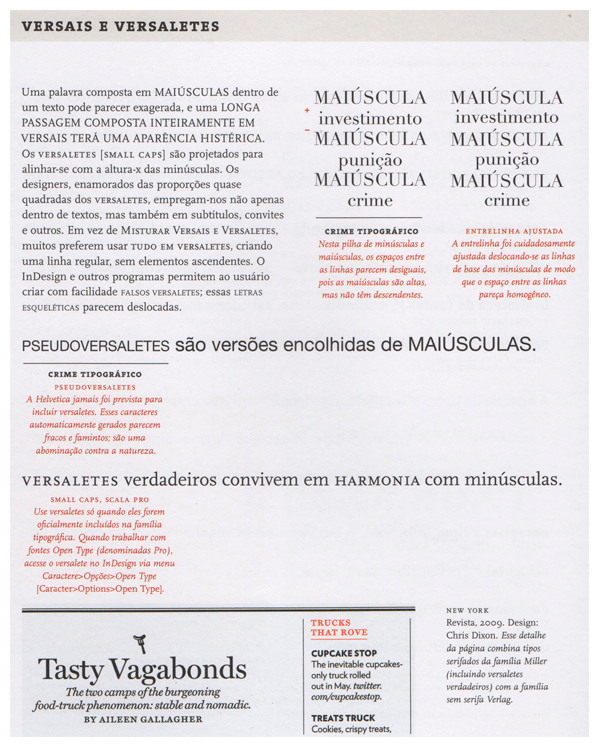
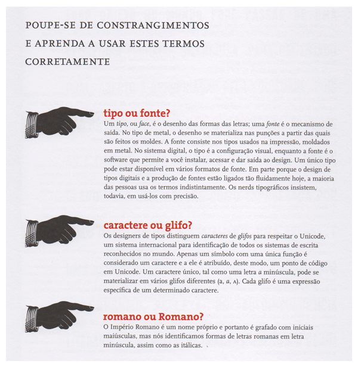

Uma obra linda e útil que apresenta ótimos exemplos on e offline e dispõe de vários exercícios de diagramação envolvendo diversos assuntos como alinhamento, listas extensas, hierarquia de informações, grid modular, letras modulares e tabelas.

No final ainda temos um apêndice com “bons conselhos”, amostras de edição de originais no papel e no computador e revisão de provas.

*Esse texto pertence a série "Revividos". São posts que foram realizados no antigo blog cmyk ativo e, por algum motivo possuem importância para estarem presentes aqui.*