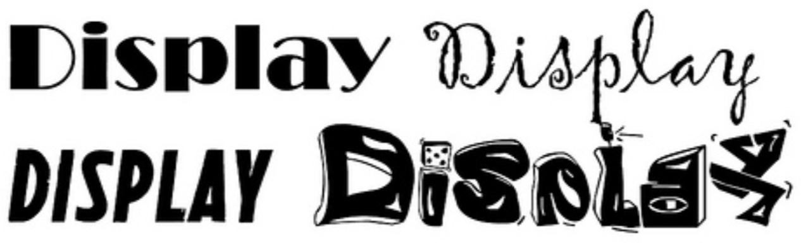
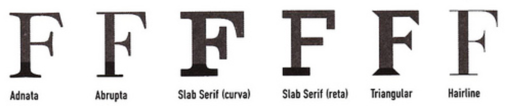
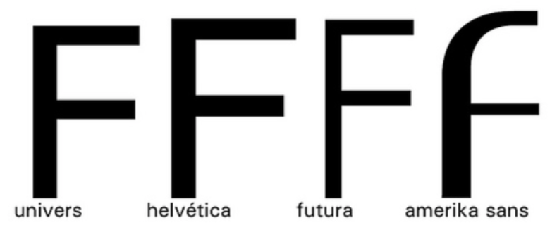

## O básico sobre tipografia

Como assunto inicial, escolhi a tipografia! Dentre os motivos pelos quais fiz esta escolha, está a falta de conhecimento do tema. É muito comum ouvir alguns comentários à respeito de clientes que pedem "Comic Sans" no projeto todo. Bom, não estou aqui pra criticar a tão controversa fonte, mas sim para explicar um pouco sobre como aplicar corretamente a tipografia em um livro.
Primeiramente, vou fazer uma classificação de fontes bem básica: tipos **display** e tipos de **texto**.

## Display

Display é aquela fonte para chamar atenção (bem tosca a explicação, mas é isso). Ela deve ser aplicada em títulos principalmente, pois a função dela é dar destaque.

## Texto

Texto é aquela fonte para leitura (principalmente de textos longos). É uma fonte com menos ornamentos e que permanece mais neutra na página.

Vamos lá, pensando no miolo do livro, fica bem claro que você precisa de uma fonte display para os títulos e uma de texto para leitura. Uma característica comum à todas as fontes é que podem ser serifadas ou não.

> Serifa é o traço colocado no início ou no final das hastes e das barras de letras

### Serifa

Em relação às serifas, existem algumas diferenças, como define Cláudio Rocha:

> Existem várias formas de serifa, e entre elas temos: adnata (curva), que flui suavemente na junção com a haste; abrupta (reta), cuja junção com a haste se dá em ângulo reto, slab serif, que tem a mesma espessura da haste e apresenta junção curva ou reta, caracterizando o grupo de fontes Egípcias, produzidas a partir do século XIX, wedge serif com serifas triangulares ou em forma de cunha. A fonte Matrix, da Emigre, é um exemplo; hairline, de espessura fina, caracteriza, por exemplo, as fontes Bodoni e Didot.

As fontes sem serifa, não possuem este elemento na estrutura, como nas tipografias abaixo:

A serifadas são tidas como melhores no quesito legibilidade, pois considera-se que as serifas direcionam os olhos durante a leitura. Entretanto, a legibilidade também é uma característica das não serifadas, por isso, este é um ponto questionável. Uma realidade é que as fontes serifadas são muito comuns em livros, principalmente os com textos muito longos. As não serifadas são vistas em livros de design, geralmente.

O importante na hora de escolher a tipografia certa para o livro é ver a finalidade dele: livros infantis, por exemplo, tem textos curtos, por isso algumas fontes diferenciadas (como a famigerada Comic Sans) se encaixam bem, já livros com um tema pesado, como uma tese, que possui um texto muito longo, com rodapés, citações e legendas, ficam mais agradáveis com fontes serifadas, que se encaixam bem a situação, como a Garamond, Times e Minion com seus contrastes de hastes.
É essencial perceber a diferença entre os tipos de fontes, afinal uma fonte de texto pode ser usada como display, mas dificilmente uma fonte display poderá ser utilizada para um texto.

*Esse texto pertence a série "Revividos". São posts que foram realizados no antigo blog cmyk ativo e, por algum motivo possuem importância para estarem presentes aqui.*