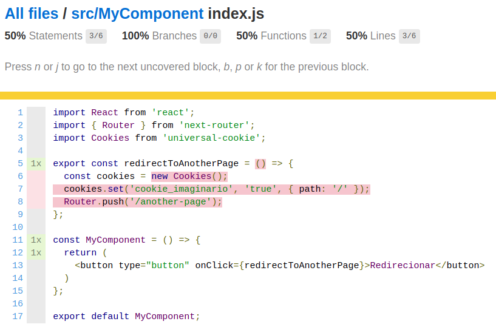

**OLAR**, bora aprender como mockar o método `Router.push` do Next?

Estou escrevendo este post porque cheguei na conclusão que é cansativo sair copiando código, testando teorias de várias pessoas tiradas de issues do Github e posts do StackOverflow e às vezes acabar não aprendendo realmente o conceito por trás da solução.

Então ao final deste post a esperança é que você aprenda como fazer esse mock e de outras libs também.

## Libs e versões utilizadas

- "next": "^9.4.4";
- "react": "^16.13.1";
- "@testing-library/jest-dom": "^5.10.1";
- "@testing-library/react": "^10.2.1";

## O componente

Dando um pouco de contexto, meu componente tem um botão que executa a função `redirectToAnotherPage`, onde vai setar um cookie (utilizando a lib `universal-cookie` e isso é irrelevante 😂) e depois dar um `Router.push`, redirecionando o usuário. Essa função está fora do componente simplesmente pra não sofrer nenhum `rerender`.

```jsx
import React from 'react';
import { Router } from 'next-router';
import Cookies from 'universal-cookie';

const redirectToAnotherPage = () => {
  const cookies = new Cookies();
  cookies.set('cookie_imaginario', 'true', { path: '/' });
  Router.push('/another-page');
};

const MyComponent = () => {
  return (
    <button type="button" onClick={redirectToAnotherPage}>Redirecionar</button>
  )
};

export default MyComponent;
```

Rodando o comando do Jest para coletar a cobertura de código `jest --collect-coverage`, recebi o resultado abaixo. Tudo em vermelho significa `statement not covered`.



## Desenvolvendo o pensamento

Antes de tudo, vamos testar se nosso botão está no DOM:

```jsx
import React from 'react';
import { render, screen } from '@testing-library/react';
import MyComponent from './index';

describe('[Components]: Button', () => {
  test('should be in the DOM', () => {
    render(<MyComponent />);
    const button = screen.getByText('Redirecionar');
    expect(button).toBeInTheDocument();
  });
});

```

Agora vamos criar outro teste somente clicando no botão ( [fireEvent](https://testing-library.com/docs/dom-testing-library/api-events/#fireevent) dentro de [act](https://testing-library.com/docs/react-testing-library/api/#act)) e sem `expect`:

```jsx
import React from 'react';
import { fireEvent, render, screen } from '@testing-library/react';
import { act } from 'react-dom/test-utils';
import MyComponent from './index';

describe('[Components]: Button', () => {
  test('should be in the DOM', () => {
    render(<MyComponent />);
    const button = screen.getByText('Redirecionar');
    expect(button).toBeInTheDocument();
  });
  test('should redirect', () => {
    render(<MyComponent />);
    const skipButton = screen.getByText('Redirecionar');
    act(() => {
      fireEvent.click(skipButton);
    });
  });
});
```

Este teste passou, é claro, não espera nada. Agora temos que pensar em como interceptar o método executado após o click. Para isso precisaremos de um [spyOn](https://jestjs.io/pt-BR/docs/jest-object#jestspyonobject-methodname) do Jest. A sintaxe segundo a documentação é: `jest.spyOn(objeto, método)`, então vamos importar o `Router` e testar:

```jsx
  import React from 'react';
  import { Router } from 'next-router';
  // ... outros imports

  test('should redirect', () => {
    const spyRouter = jest.spyOn(Router, 'push');
    render(<MyComponent />);
    const skipButton = screen.getByText('Redirecionar');
    act(() => {
      fireEvent.click(skipButton);
    });
    expect(spyRouter).toHaveBeenCalled();
  });
```

Ué, deu erro... Está dizendo que nenhuma instância do router foi encontrada e que nós deveríamos usar `next/router` somente dentro do client side da nossa aplicação... 🤔

```bash
    No router instance found.
    You should only use "next/router" inside the client side of your app.

       6 |   const cookies = new Cookies();
       7 |   cookies.set('cookie_imaginario', 'true', { path: '/' });
    >  8 |   Router.push('/another-page');
         |          ^
       9 | };
```

A questão é que existe uma instância sim, ela só não está mockada. E como nós provamos isso? Basta adicionar um `console.log(Router)`, logo após abrir o teste `should redirect` e, no seu terminal poderá ver a resposta abaixo:

```bash
  console.log
    {
      router: null,
      readyCallbacks: [
        [Function],
        [Function],
        [Function],
        [Function],
        [Function],
        [Function]
      ],
      ready: [Function: ready],
      push: [Function],
      replace: [Function],
      reload: [Function],
      back: [Function],
      prefetch: [Function],
      beforePopState: [Function],
      pushRoute: [Function],
      replaceRoute: [Function],
      prefetchRoute: [Function]
    }
```

Vamos deixar o `console.log` onde está, adicionar uma linha no nosso código após os imports e rodar o teste novamente:

```jsx
  import React from 'react';
  import { Router } from 'next-router';
  // ... outros imports

  jest.mock('next/router');
```

Agora os métodos foram mockados, o teste passou e a cobertura está com 100% neste componente. 🎉 🎉

E como eu sei que não é um falso positivo? Simples, coloque `expect(true).toBe(false);` logo após o `expect(spyRouter).toHaveBeenCalled();` e veja o teste quebrar. 😊

Não vou colar a resposta inteira do `console.log` mas abaixo podemos ver como ficou o método `push`. Veja todos os `mock-alguma-coisa` indicando que o mock está funcionando:

```bash
  push: [Function: mockConstructor] {
    _isMockFunction: true,
    getMockImplementation: [Function],
    mock: [Getter/Setter],
    mockClear: [Function],
    mockReset: [Function],
    mockRestore: [Function],
    mockReturnValueOnce: [Function],
    mockResolvedValueOnce: [Function],
    mockRejectedValueOnce: [Function],
    mockReturnValue: [Function],
    mockResolvedValue: [Function],
    mockRejectedValue: [Function],
    mockImplementationOnce: [Function],
    mockImplementation: [Function],
    mockReturnThis: [Function],
    mockName: [Function],
    getMockName: [Function]
  },
```

## Solução final

```jsx
  import React from 'react';
  import { Router } from 'next-router';
  import { fireEvent, render, screen } from '@testing-library/react';
  import { act } from 'react-dom/test-utils';
  import MyComponent from './index';

  jest.mock('next/router');

  describe('[Components]: Button', () => {
    test('should be in the DOM', () => {
      render(<MyComponent />);
      const button = screen.getByText('Redirecionar');
      expect(button).toBeInTheDocument();
    });

    test('should redirect', () => {
      const spyRouter = jest.spyOn(Router, 'push');
      render(<MyComponent />);
      const skipButton = screen.getByText('Redirecionar');

      act(() => {
        fireEvent.click(skipButton);
      });

      expect(spyRouter).toHaveBeenCalled();
    });
  });
```

## Solução alternativa

Na primeira solução nós estávamos importando o `next/router` e desestruturando o `Router`, agora nós estamos lidando com todos os métodos da lib por isso o `push` está dentro da chave `default`. Lembrando que para ver o objeto e seus métodos basta fazer: `console.log(require('next/router'))`.

```jsx
import React from 'react';
import { fireEvent, render, screen } from '@testing-library/react';
import { act } from 'react-dom/test-utils';
import MyComponent from './index';

jest.mock('next/router', () => ({
  ...jest.requireActual('next/router'),
  default: {
    push: jest.fn(),
  },
}));

describe('[Components]: Button', () => {
  test('should be in the DOM', () => {
    render(<MyComponent />);
    const button = screen.getByText('Redirecionar');
    expect(button).toBeInTheDocument();
  });

  test('should create cookie and redirect', () => {
    const spyRouter = jest.spyOn(require('next/router').default, 'push');
    render(<MyComponent />);
    const skipButton = screen.getByText('Redirecionar');

    act(() => {
      fireEvent.click(skipButton);
    });

    expect(spyRouter).toHaveBeenCalled();
  });
});
```

## Referências

- [How to mock useRouter?](https://github.com/vercel/next.js/issues/7479)
