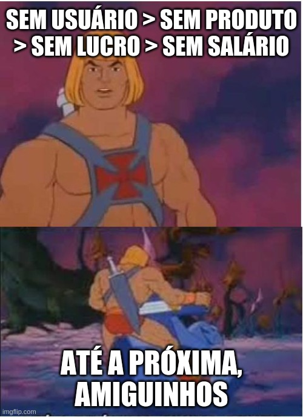
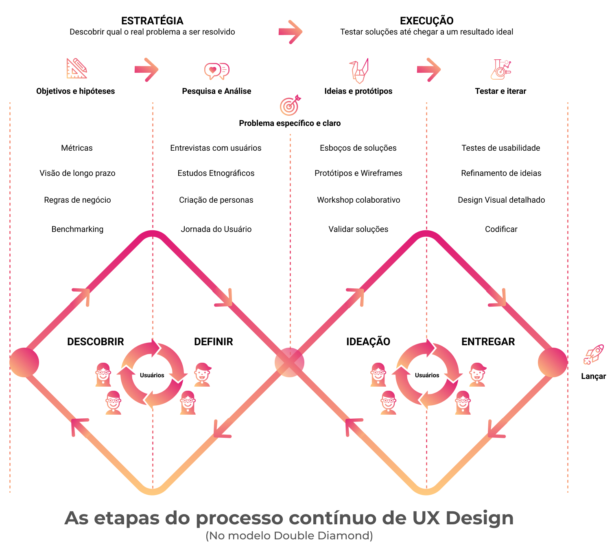

## **Antes de tudo: UX não é só para designers**

> Hoje, bons designers já perceberam que são os desenvolvedores que fazem dele um bom designer, já que são eles os responsáveis por fazer suas ideias tomarem forma. Designers sem desenvolvedores só fazem layouts estáticos, que ficam bonitos no portfólio mas que não chegam a impactar positivamente a rotina do público final. - Introdução e boas práticas em UX Design.

## **O que é Design?**

O significado da palavra **Design** é discutido até hoje e o qual me faz mais sentido é **projeto**.

Muitas vezes nós vemos a palavra **Design** sendo vinculada a **Estética**. Um exemplo frequente são os comerciais de carros: "Design inovador", "Design robusto", e variações.

Segundo evidências, isso provavelmente vem da década de 1930, de um movimento chamado **Styling** que manipulava a estética sem melhoramentos na função para que os produtos se tornassem mais atrativos e impulsionassem o consumo numa sociedade americana pós-guerra.

## **O que é UX?**

Traduzido para o português significa "Experiência do Usuário".

- Vivência: o que foi vivido;
- Acontecimento: viagens, eventos;
- Conhecimento: domínio sobre o uso de alguma ferramenta ou em algum cargo;
- Sentimento: referência a um acontecimento e ao que você sentiu no momento.

UX Design é sobre entender o real propósito de um problema que precisa ser resolvido (através da empatia), definir que tipo de pessoa precisa ter esse problema resolvido (personas) e qual vai ser o caminho que você deve percorrer para conseguir resolver esse problema (design).

> "Pensar em UX envolve o atendimento às expectativas do usuário e o fornecimento de um serviço ou produto de qualidade, preferencialmente, de uma forma simples e direta." - Alura.

### De onde veio o termo?

O termo foi criado em 1993 por Donald Norman, vice-presidente de Tecnologia Avançada da Apple, no início da década de 1990. O termo foi criado considerando a falta de um para fazer referência à experiência do usuário de maneira abrangente.

### Tecniquês

> User Experience são as percepções e respostas resultantes do uso ou uso antecipado de um produto, sistema ou serviço.
https://www.iso.org/obp/ui/#iso:std:iso:9241:-210:ed-1:v1:en

> User Experience Design é o processo de aprimorar a satisfação do usuário melhorando a usabilidade, acessibilidade e prazer gerados na interação entre o usuário e o produto.

### Empatia é a chave

A habilidade de entender e compartilhar os sentimentos do próximo. 
Conhecer o seu público, com quem você está trabalhando e para quem você está projetando é essencial.
Tente buscar o que eles gostam, fazem, pensam, sentem e, principalmente, quais problemas eles têm.

## **E eu com isso? Só quero programar...**

Você programa pra quem? Não é pra empresa, é para o usuário.

## **Então, qual a importância de UX Design mesmo?**

> UX é importante porque coloca a perspectiva do usuário como a espinha dorsal de qualquer fluxo de experiência, seja ele um processo de compra, troca de informação ou teste. Se a empresa incorporar essa ideia, perguntando-se "Como isso pode ser melhor para o meu cliente?" e trabalhar para atender da melhor forma, é bem provável que o seu cliente sinta-se tão bem que manterá contato com a empresa. - [Fonte](https://www.hostinger.com.br/tutoriais/ux-o-que-e-user-experience/)

Apesar de termos acima uma afirmação lógica, um único argumento não convence CEOs e stakeholders, afinal, estamos falando de dinheiro. Isso nos leva ao próximo tópico.

### Estatísticas sobre UX

Diversas empresas apresentam uma resistência por acharem que investimentos para melhorar a experiência do usuário, ou seja, a criação de um time de UX Design, gerará um retorno insignificante. Por isso, trouxe somente alguns casos abaixo e suas respectivas fontes:

- Scroll infinito pode diminuir as taxas de abandono na sua homepage (bounce rate). O site Time.com reduziu o abandono em 15 pontos percentuais depois de adotarem scroll infinito na página inicial. ([Fonte](http://www.poynter.org/news/mediawire/257466/time-coms-bounce-rate-down-15-percentage-points-since-adopting-continuous-scroll/))
- Em 10 anos, um investimento de $10.000 dólares em uma empresa centrada em design teria dado um retorno de 228% maior do que um investimento convencional na bolsa de valores. ([Fonte](http://www.dmi.org/?DesignValue))
- 88% dos consumidores online alegam menos chance de retornar a um site depois de uma experiência de uso negativa. ([Fonte](https://econsultancy.com/blog/10936-site-speed-case-studies-tips-and-tools-for-improving-your-conversion-rate))
- Sites que demoram para carregar custam às empresas $2,6 bilhões de dólares por ano. ([Fonte](https://econsultancy.com/blog/9790-slow-loading-websites-cost-retailers-1-73bn-in-lost-sales-each-year))

### **Só pra resumir, o que um investimento em UX evita?**

> "- Nossa, esse produto é uma merda!" - Usuário que não voltou.

Evita justamente a frase acima. A falta de estudo do usuário e suas necessidades ocasiona o fracasso no lançamento de um produto e consequentemente causa retrabalho.

Alan Cooper - designer e programador - uma vez disse: A única coisa mais cara do que escrever sofware é escrever software ruim. Não sei você mas eu não poderia concordar mais.

## Sendo assim, como posso contribuir no processo?

Você está contribuindo toda vez que você questiona se:

- O site está acessível;
- A funcionalidade está simples;
- As informações estão claras;
- Alguma opção está difícil de ser encontrada;
- Os elementos estão padronizados;
- Nós estamos resolvendo realmente o problema do usuário.

Desde compartilhar conhecimentos sobre regra de negócio ou dar parecer técnico sobre a possibilidade de construção de uma funcionalidade até apontar um erro de português ou digitação. Todo esse processo está contribuindo para guiar a evolução do produto.

## Isso quer dizer que posso me considerar um Designer?

Calma lá(haha)! Você é participante do processo de design, no entanto, para guiar a evolução de maneira a chegar numa proposta adequada ao usuário e suas necessidades existem diversas metodologias e conhecimentos específicos necessários.

## Como os problemas são abordados?

Existem diversas metodologias, acredito que a mais famosa é o "Design Thinking", dependendo do autor, pode consistir num número de etapas diferentes mas em geral envolve: Empatia, Definição, Ideação, Prototipagem, Teste e Iteração.

> A ideia por trás do design thinking é oferecer aos profissionais das várias orientações/formações uma estrutura metodológica capaz de desconstruir e reconstruir, resolver e solucionar, experimentar e prototipar questões e problemas, ou seja, é uma metodologia estratégica para resolver problemas difíceis centrada nas necessidades humanas [...]. - Afinal, o que é Design Thinking, de Rique Nitzsche

Temos também o Double Diamond e trouxe a imagem abaixo (retirada do [blog de Gabriel Silvestri](https://gabrielsilvestri.com.br/o-que-e-ux-design/)) para exemplificar os processos que se encontram em cada etapa.

## Áreas da UX

É difícil dimensionar a abrangência da área de Experiência de Usuário, no entanto, um infográfico ficou muito famoso, feito por Dan Saffer que é designer de interação e autor de alguns livros sobre o assunto e, tentarei descrever a lógica a seguir da maneira mais simples possível.

- Dentro de Experiência do Usuário existe uma área chamada: `Design de Interação`;
- Ela faz intersecção com Arquitetura, Design Industrial, Design de Som, Fatores Humanos, Interação Homem-Máquina, Arquitetura da Informação e Visual Design(Design Gráfico);
- Arquitetura da Informação e Visual Design, englobam um pouco de produção de conteúdo também, como expô-lo, seja texto, vídeo ou som.

## E todo mundo faz tudo?

Não exatamente... Designers são profissionais em T, assim como pessoas desenvolvedoras. São especialistas em alguma área e tem conhecimento suficiente para transitarem em outras.  

Por exemplo, nós vemos muitas vagas de título "UX/UI Designer", ela pode ser preenchida por um UX Researcher que tem especialidade em pesquisa e conhecimentos em UI ou por um UI Designer com conhecimentos em UX, dependerá do que a empresa precisa no momento. Se for o caso de levar adiante uma iniciativa de Design System, provavelmente o UI Designer será mais interessante, caso seja para orientar outros UX Designers em pesquisa, o UX Researcher terá vantagem.

Trouxe esse infográfico que parece parece meio bagunçado pra tentar exemplificar um pouco do que ocorre hoje no mercado. Nós podemos fazer dois triângulos, um na direita e outro na esquerda. Pra falar sobre o Product Designer e o UX Designer respectivamente.

Um se concentra mais nas demandas da empresa e outro do usuário, porém, vivendo em harmonia, teoricamente. haha

O que nós podemos ver é que os papéis muitas vezes se sobrepõem, se misturam. E tá tudo bem também, o escopo não é bem delimitado mas nas linhas gerais todos sabem o que esperar.

## Entre algumas coisas, nós aprendemos que:

UX Design não é:

- Direção de arte;
- Planejamento;
- Gerência de projetos;
- Desenvolvimento de software;

E sim um meio de campo entre todas essas disciplinas, garantindo que todas elas estejam caminhando juntas em direção a um mesmo objetivo. Definitivamente, uma disciplina exata, depende de uma quantidade tão grande de fatores que é impossível afirmar com precisão que o caminho certo é o A ou o B.

## **Referências**

- [User Experience, Liferay](https://www.liferay.com/pt/resources/l/user-experience)
- [Experiência do Usuário, RocketContent](https://rockcontent.com/br/blog/experiencia-do-usuario/)
- [Seven Components of User Experience](https://www.tronebrandenergy.com/blog/seven-components-user-experience-ux)
- [Design Thinking: Novos desafios, novas soluções, Labcom](http://labcom.com.br/blog/design-thinking-novos-desafios-novas-solucoes)
- [O que é UX Design?, por Gabriel Silvestri](https://gabrielsilvestri.com.br/o-que-e-ux-design/)
- Livro: Introdução e boas práticas em UX Design, por Fabricio Teixeira
